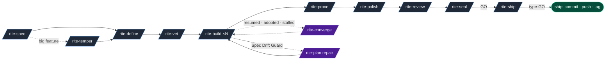

<p align="center">
  
</p>


DevRites gives Claude Code and Codex a repeatable way to plan, build, prove,
and ship a feature. The workflow lives in your repository, so another agent can
resume the work without relying on chat history.

If you remember one sequence, use this one:
`SPEC -> DEFINE -> VET -> BUILD -> PROVE -> POLISH -> REVIEW -> SEAL -> SHIP`.
Seal makes the release decision. Ship changes git. Build handles one slice at a
time, while Autocomplete is an opt-in loop that starts from a clean baseline.

Each feature gets its own `.devrites/work/<slug>/` directory. It contains a
workspace map, the brief and spec, the plan and slices, the current state, and
the evidence collected along the way. Optional files record strategy, design,
reviews, decisions, assumptions, drift, questions, and handoff context. When the
task ships, DevRites moves the directory intact to `.devrites/archive/<slug>/`.

The Spec Drift Guard stops a build when implementation no longer matches the
plan. AFK mode can run unattended, but it still pauses for destructive
migrations, auth changes, public API breaks, and failed checks. Before Ship can
commit, push, or tag, you must type `GO`. Project principles in
`.devrites/principles.md` apply your standing rules to every plan, build, and
seal. Recorded exceptions remain possible when a feature genuinely needs one.

```
.devrites/
  ACTIVE                    # which feature is active
  AFK                       # presence = AFK mode; YAML body sets max_slices / notify / allow_gates
  principles.md             # project invariants: authored, prescriptive, GATING (the 4th knowledge layer)
  conventions.md            # learned project idioms: descriptive, an untrusted prior
  learnings.md              # dismissed-finding classes + dead ends: suppresses recurring false positives
  work/<slug>/
    README.md  brief.md  spec.md  references.md  references/  # workspace map + spec
    strategy.md                                          # temper (optional)
    architecture.md  flows.md  plan.md  tasks.md  traceability.md  # define
    eng-review.md  test-plan.md                          # vet
    forge-report.md                                      # build (Forge candidates → winner)
    state.md  questions.md  decisions.md  assumptions.md  drift.md
    touched-files.md  evidence.md  browser-evidence.md  design-brief.md
    polish-report.md  review.md  seal.md  ship.md  handoff.md
  archive/<slug>/             # shipped task, moved here intact (all .md preserved)
```

DevRites makes the agent ask questions before it writes code and requires proof
before it calls the feature complete.

**Two run modes, same workflow:**

- **HITL** (default, human-in-the-loop): you're at the keyboard. Slices marked
  `Mode: HITL` pause **before** code is written at a typed checkpoint (`advisory` /
  `validating` / `blocking` / `escalating`); resume on
  [`/rite-resolve <qid> "<answer>"`](pack/.claude/skills/rite-resolve/SKILL.md).
- **AFK** (away-from-keyboard): drop `.devrites/AFK` in the project. AFK slices run
  unattended; discretionary pauses downgrade to advisory entries in `questions.md` so
  the loop keeps moving. **Destructive migrations, auth/authz changes, public-API
  breaks, and red tests/types/lint always pause regardless**. AFK does not
  accept irreversible risk on its own. Optional `max_slices` caps the loop; optional `notify:`
  pings your phone on a pause.

See [Run modes](#run-modes) for the full contract.

Every phase is available **two ways**: the menu form `/rite <verb>` (one entry,
discoverable from `/rite`) and the direct shortcut `/rite-<verb>` (muscle
memory). Both hit the same skill: `/rite spec foo` ≡ `/rite-spec foo`.

| # | Phase | Menu form | Direct shortcut | Does |
|---|---|---|---|---|
| 1 | SPEC | `/rite spec` | [`/rite-spec`](pack/.claude/skills/rite-spec/SKILL.md) | investigate + write spec.md |
| optional | TEMPER | `/rite temper` | [`/rite-temper`](pack/.claude/skills/rite-temper/SKILL.md) | strategic review for larger features; covers scope and pre-mortem, then updates the spec (always run by autocomplete) |
| 2 | PLAN | `/rite define` | [`/rite-define`](pack/.claude/skills/rite-define/SKILL.md) | spec → plan + slices (each tagged AFK \| HITL + gate) |
| required | VET | `/rite vet` | [`/rite-vet`](pack/.claude/skills/rite-vet/SKILL.md) | engineering review of scope, architecture, tests, and performance; updates the plan and writes `test-plan.md` |
| 3 | BUILD ×N | `/rite build` | [`/rite-build`](pack/.claude/skills/rite-build/SKILL.md) | one slice, then stop (HITL slices pause pre-code) |
| recovery | CONVERGE | `/rite converge` | [`/rite-converge`](pack/.claude/skills/rite-converge/SKILL.md) | compare live code with the feature intent and append the remaining work as new slices |
| 4 | PROVE | `/rite prove` | [`/rite-prove`](pack/.claude/skills/rite-prove/SKILL.md) | tests + browser proof |
| 5 | POLISH | `/rite polish` | [`/rite-polish`](pack/.claude/skills/rite-polish/SKILL.md) | code + UI polish |
| 6 | REVIEW | `/rite review` | [`/rite-review`](pack/.claude/skills/rite-review/SKILL.md) | multi-axis, parallel |
| 7 | SEAL | `/rite seal` | [`/rite-seal`](pack/.claude/skills/rite-seal/SKILL.md) | GO / NO-GO decision (no git) |
| 8 | SHIP | `/rite ship` | [`/rite-ship`](pack/.claude/skills/rite-ship/SKILL.md) | type-GO + commit/push/tag, then archive + close |
| resume | RESUME | `/rite resolve` | [`/rite-resolve`](pack/.claude/skills/rite-resolve/SKILL.md) | answer a HITL gate, clear `Awaiting human`, and resume |
| automatic | AUTO | `/rite autocomplete` | [`/rite-autocomplete`](pack/.claude/skills/rite-autocomplete/SKILL.md) | run the whole lifecycle unattended (`--ship` allows a push) |

Common utilities that sit outside the main lifecycle:

| Utility | Menu form | Direct shortcut | Does |
|---|---|---|---|
| POV | `/rite pov` | [`/rite-pov`](pack/.claude/skills/rite-pov/SKILL.md) | project-grounded adopt / switch / reject verdict for an external option |
| DOGFOOD | `/rite dogfood` | [`/rite-dogfood`](pack/.claude/skills/rite-dogfood/SKILL.md) | exploratory browser QA for real user journeys |
| PR FEEDBACK | `/rite pr-feedback` | [`/rite-pr-feedback`](pack/.claude/skills/rite-pr-feedback/SKILL.md) | resolve GitHub PR review threads with evidence |

If implementation reveals the plan is wrong, the **Spec Drift Guard** stops
the build, records the drift, asks you when product behavior changes, and
routes through [`/rite-plan repair`](pack/.claude/skills/rite-plan/SKILL.md)
before resuming.



Full diagram set (lifecycle, polish orchestrator, review fan-out, debug loop,
rules carrier, workspace state, namespace map) →
[`docs/flow.md`](docs/flow.md).

Current release: [`v3.0.5`](https://github.com/ViktorsBaikers/DevRites/releases/tag/v3.0.5).
See [`CHANGELOG.md`](CHANGELOG.md) for release notes.

## Contents

- [Why distributed skills](#why-distributed-skills-not-one-engine)
- [Run modes](#run-modes)
- [Install](#install): [npx / bash](#installing) · [upgrade](#upgrading-an-existing-install)
- [Recommended setup](#recommended-setup): codegraph · graphify · Playwright MCP
- [Skills](#skills): 42 total · full catalogue in [`docs/skills.md`](docs/skills.md)
- [Typical workflow](#typical-workflow) · [Worked examples](docs/usage.md)
- [Engineering rules](#engineering-rules) · [Browser proof ladder](#browser-proof-ladder) · [Frontend & fullstack](#frontend--fullstack)
- [Safety & scope](#safety--scope) · [Security model](#security-model)
- [Layout](#layout) · [Community & quality](#community--quality) · [Release pipeline](docs/release.md) · [License](#license)

**Companion docs:**
[architecture](docs/architecture.md) ·
[skills catalogue](docs/skills.md) ·
[command map](docs/command-map.md) ·
[flow diagrams](docs/flow.md) ·
[orchestration](docs/orchestration.md) ·
[usage examples](docs/usage.md) ·
[release pipeline](docs/release.md) ·
[engineering rules](pack/.claude/skills/devrites-lib/reference/standards/README.md) · [quick reference](docs/quick-reference.md)

## Why distributed skills, not one `/engine`

A single command would load every phase's instructions at once and make each
step harder to inspect. DevRites instead splits the lifecycle across small
`rite-*` skills. Each skill loads only the guidance its phase needs.
[`/rite-autocomplete`](pack/.claude/skills/rite-autocomplete/SKILL.md) coordinates
the full unattended loop, and `devrites-*` specialists load only when a matching
task calls for them.

**Naming:** the `devrites-` prefix is a **namespace** for collision avoidance against
bundled Claude Code skill names (`prototype`, `handoff`, `triage`, `diagnose`, and others).
it does not signal "internal." Visibility is governed by each skill's
`user-invocable:` flag, while `disable-model-invocation` independently controls
automatic loading. See
[`docs/flow.md` § Public vs internal namespace](docs/flow.md#8-public-vs-internal-namespace).

Full rationale: [`docs/architecture.md`](docs/architecture.md).

## Install

DevRites installs host artifacts into the project. It never writes skills,
agents, or hooks to `~/.claude` or `~/.codex`. Install with `npx` (recommended)
or the `curl | bash` bootstrap. Both delegate to the same engine-owned install
semantics and ship Claude Code/Codex skills, agents, standards, hooks, and aliases;
the optional shared engine binary is the only global artifact.

### Installing

With Node 18 or later, use `npx`:

```bash
# Install the full pack into the current project
npx devrites@latest

# Into a specific project, or preview first
npx devrites@latest --target /path/to/your/project
npx devrites@latest --dry-run

# Upgrade or remove later
npx devrites@latest update
npx devrites@latest uninstall
```

`npx devrites` is a native Node 18+ shim over the engine-owned installer. The host
payload is bundled and pinned to the package version you request (`@latest` or
an exact published version). To launch the engine, the shim first tries the matching checksummed
release binary, then a local Go build, then an existing `devrites-engine`. It does
not invoke `install.sh` and does not require Bash. Installed Claude/Codex artifacts
stay in the target project; unless `--no-binary` is set, the installer may also
place the shared engine binary in the configured user/system bin directory.
Prebuilt binaries ship for macOS arm64/amd64, Linux arm64/amd64, and Windows amd64.

Without Node or a local clone, use the Bash bootstrap:

```bash
# Install latest release into the current directory
curl -fsSL https://raw.githubusercontent.com/ViktorsBaikers/DevRites/main/install.sh | bash

# Install into a specific project
curl -fsSL https://raw.githubusercontent.com/ViktorsBaikers/DevRites/main/install.sh | bash -s -- --target /path/to/your/project

# Preview (no changes)
curl -fsSL https://raw.githubusercontent.com/ViktorsBaikers/DevRites/main/install.sh | bash -s -- --dry-run

# Pin to a specific release
curl -fsSL https://raw.githubusercontent.com/ViktorsBaikers/DevRites/main/install.sh | DEVRITES_REF=vX.Y.Z bash
```

The script is self-bootstrapping: when piped through `bash` it auto-downloads the latest
release tarball (or the `main` source archive as fallback) into `/tmp` and re-execs from
there. Requires `curl` and `tar`. After bootstrap, install/update/uninstall semantics
run through `devrites-engine`; the shell scripts only acquire a bundle/binary and pass
arguments through. Agent files stay project-local and global agent homes are refused. By
default the engine downloads or builds a verified `devrites-engine` control-plane binary
and writes it to `/usr/local/bin` or `~/.local/bin`; use `--no-binary` or
`DEVRITES_NO_BINARY=1` to skip that global bin install.

**From a local checkout** (same script, no network needed):

```bash
git clone https://github.com/ViktorsBaikers/DevRites devrites && cd devrites
./install.sh --target /path/to/your/project        # or run from inside the project
./install.sh --dry-run                              # preview, change nothing
```

Common flags:

| Flag | Effect |
|---|---|
| `--target DIR` | Install into DIR (default: current directory) |
| `--dry-run` | Show planned file operations and exit |
| `--force` | Overwrite existing non-DevRites files |
| `--no-agents` | Skip the review subagents |
| `--no-codex` | Skip Codex support files (`.agents/skills`, `.codex/agents`, `AGENTS.md`) |
| `--no-skills` | Skip skills and bundled engineering standards |
| `--no-binary` | Skip the global `devrites-engine` control-plane binary |
| `--no-rules` | Deprecated no-op; standards ship inside `devrites-lib` |
| `--rules-only` | Deprecated no-op; installs normally for compatibility |
| `--short-aliases=all` | Add `/define`, `/build`, `/prove`, `/seal` short aliases (off by default) |

Every installed project file is recorded in `.claude/devrites.manifest` (with the
installed version and the original install flags in the header). `./uninstall.sh`
removes exactly those files, prunes empty directories, and removes the shared
`devrites-engine` binary unless you pass `--keep-binary`. It preserves your
feature data in `.devrites/work/` and `.devrites/ACTIVE`.

### Upgrading an existing install

**One-liner over the network**:

```bash
# Upgrade the install in the current directory
curl -fsSL https://raw.githubusercontent.com/ViktorsBaikers/DevRites/main/update.sh | bash

# Upgrade an install elsewhere
curl -fsSL https://raw.githubusercontent.com/ViktorsBaikers/DevRites/main/update.sh | bash -s -- --target /path/to/proj

# Just check (exit 10 = update available, 0 = current)
curl -fsSL https://raw.githubusercontent.com/ViktorsBaikers/DevRites/main/update.sh | bash -s -- --check
```

From a local checkout:

```bash
./update.sh                          # upgrade install in current directory
./update.sh --target /path/to/proj   # upgrade install elsewhere
./update.sh --check                  # report installed vs latest, change nothing
./update.sh --to vX.Y.Z              # pin to a specific release tag
./update.sh --pre                    # allow pre-release tags
./update.sh --force                  # reinstall even when already current
```

`update.sh` resolves the requested/latest release during bootstrap, acquires its
bundle and engine, then delegates to `devrites-engine update`. The engine replays
the original flags from `.claude/devrites.manifest` with force semantics.
`.devrites/` (active feature and work) is preserved because update only manages
the installed artifact set.

### Uninstalling

```bash
# Network one-liner
curl -fsSL https://raw.githubusercontent.com/ViktorsBaikers/DevRites/main/uninstall.sh | bash
curl -fsSL https://raw.githubusercontent.com/ViktorsBaikers/DevRites/main/uninstall.sh | bash -s -- --target /path

# Local checkout
./uninstall.sh                       # remove DevRites from the current project
./uninstall.sh --target /path/to/proj
./uninstall.sh --dry-run             # preview, change nothing
```

Removes only files listed in `.claude/devrites.manifest` and prunes empty dirs,
including Codex mirrors when they were installed.
`.devrites/work/` (your feature data) is always preserved.

## Recommended setup

DevRites works without extra tooling. These integrations give it better code
navigation and stronger browser evidence. Configure the ones your project uses;
DevRites falls back to files, project tests, or manual steps when they are absent.

| Tool | What it gives DevRites | Set up |
|---|---|---|
| **codegraph** | Gives `/rite-spec`, `/rite-define`, and `/rite-plan` an index of project structure, symbol placement, callers, and impact. | Build the index in your project (for example, `codegraph init`) so its `codegraph_*` tools or a `.codegraph/` directory are present. |
| **graphify** | Generates a knowledge graph in `graphify-out/` for questions about definitions, callers, and change impact. | Generate it with the `/graphify` skill. |
| **[Playwright MCP](https://github.com/microsoft/playwright-mcp)** | Lets `/rite-prove` and `/rite-polish` collect screenshots, console output, network activity, and responsive checks from a real browser. Chrome DevTools MCP can add Lighthouse and performance traces. | Configure the Playwright MCP server in Claude Code. DevRites detects it but does not install it. |

Without these tools, DevRites reads files instead of a code graph and uses
Claude Code's built-in `/run` and `/verify`, project-native tests, or documented
manual steps instead of a browser.

## Skills

The pack ships 42 skills: the `rite` menu, 29 user-invocable `rite-*`
workflow and utility skills, 11 model-invoked `devrites-*` specialists, plus the internal
`devrites-lib` reference library. The installed `devrites-engine` owns workflow control;
the npm `devrites` shim owns install/update/uninstall and proxies engine subcommands.
`rite-*` and `devrites-*` are namespaces, not visibility rules: frontmatter is
authoritative. Workspace-operating lifecycle skills read `core.md` in step 0 and disclose
phase rules on demand; compact utilities keep their narrower contract local.

**Claude Code invocation.** Every public `rite-*` workflow responds to **both** `/rite <verb>` (through the `rite` menu/router) and `/rite-<verb>` (direct shortcut). The forms are equivalent: `/rite build slice-2` ≡ `/rite-build slice-2`. Use whichever reads more naturally. Installation merges DevRites event hooks into an existing `.claude/settings.json` without replacing user entries; an existing non-DevRites `statusLine` is preserved with a warning because Claude exposes one status-line slot.

**Codex invocation.** The installer mirrors the same skills to `.agents/skills/`, mirrors DevRites rules to `.agents/skills/devrites-lib/reference/standards/`, injects a Codex compatibility block after each skill's front matter, generates project custom agents in `.codex/agents/`, installs Codex hooks in `.codex/hooks.json`, and creates or merges the needed Codex guidance into `AGENTS.md`. If `AGENTS.md` already exists, DevRites adds a marked block instead of replacing your guidance. In Codex, invoke DevRites via `$rite`, `$rite-spec`, or `/skills`; if you prefer a Claude-only footprint, install with `--no-codex`. Codex must trust the project `.codex/` layer and review the hooks via `/hooks` before non-managed hooks run.

**Rules in Codex.** DevRites engineering rules are mirrored as Markdown under
`.agents/skills/devrites-lib/reference/standards/` because they are workflow/craft
instructions, not Codex command-approval `.rules` files. Generated guidance points at the
mirror; each skill's own contract decides whether `core.md` or a conditional standard loads.

You can add one-word aliases for any `rite-*` skill with `scripts/pin.sh`. For
example, map `/b` to `/rite-build` or `/ship` to `/rite-ship`. The installer uses
the same thin wrapper for `--short-aliases=all`, and the manifest records each
alias so `./uninstall.sh` can remove it.

```bash
./scripts/pin.sh add b rite-build      # /b == /rite-build
./scripts/pin.sh add ship rite-ship    # /ship == /rite-ship
./scripts/pin.sh list                  # show currently-pinned aliases
./scripts/pin.sh remove b              # drop the alias
```

Pinned aliases live at `.claude/skills/<alias>/SKILL.md` and mirror to `.agents/skills/<alias>/SKILL.md` when Codex support is installed. The script refuses `rite-*` names, unknown targets, and global agent homes.

### Full skill + agent inventory

The public command surface contains `rite` and 29 `rite-*` skills:

| Group | Skills |
|---|---|
| Core lifecycle (8) | `rite-spec` · `rite-define` · `rite-build` · `rite-prove` · `rite-polish` · `rite-review` · `rite-seal` · `rite-ship` |
| On-ramp (optional) | `rite-adopt` onboards an existing codebase, derives `spec.md`, seeds the conventions ledger, proposes project principles, and hands off to the lifecycle. |
| Strategic (optional) | `rite-temper` reviews the spec between spec and define. `rite-autocomplete` always runs it. |
| Engineering (every feature) | `rite-vet` reviews the engineering plan between define and build. Its depth scales with the stakes, but it always runs. |
| Recovery / replan | `rite-resolve` · `rite-plan` · `rite-converge` |
| Express / pre-flight | `rite-quick` · `rite-frame` |
| Utility | `rite-status` · `rite-doctor` · `rite-customize` · `rite-explain` · `rite-pov` · `rite-dogfood` · `rite-pr-feedback` · `rite-zoom-out` · `rite-prototype` · `rite-handoff` · `rite-pressure-test` · `rite-autocomplete` |
| Learning (optional) | `rite-learn` finds recurring mistakes and dismissed findings in shipped features, proposes project-local lessons in `.devrites/learnings.md`, and promotes recurring invariants to `.devrites/principles.md`. |
| Menu | `rite` |

The model-invoked `devrites-*` specialists stay hidden from the menu:

`devrites-interview` · `devrites-source-driven` · `devrites-doubt` ·
`devrites-ux-shape` · `devrites-frontend-craft` · `devrites-browser-proof` ·
`devrites-debug-recovery` · `devrites-api-interface` ·
`devrites-audit` (axes: `security` · `perf` · `simplify`) ·
`devrites-prose-craft` · `devrites-refresh-indexes`.

Twelve fresh-context review agents live under `.claude/agents/`:

`devrites-strategy-reviewer` (pre-plan, via `/rite-temper`) ·
`devrites-plan-reviewer` (pre-build, via `/rite-vet`) · `devrites-spec-reviewer` ·
`devrites-code-reviewer` · `devrites-test-analyst` · `devrites-frontend-reviewer` ·
`devrites-security-auditor` · `devrites-performance-reviewer` ·
`devrites-devex-reviewer` (developer-facing surface, predict at `/rite-vet` + measure-the-boomerang at `/rite-seal`) ·
`devrites-doubt-reviewer` · `devrites-simplifier-reviewer` ·
`devrites-forge-judge` (used by `/rite-build` to score competing candidates for a
`Forge: yes` slice and pick the winner).

The read-only `devrites-retrospector` looks across the shipped archive rather
than one diff. `/rite-ship` dispatches it on a cadence to find recurring patterns
and draft candidates for `/rite-learn`; it proposes changes but does not apply
them.

`devrites-slice-wright` is the one write-capable agent. `/rite-build` dispatches
it to orient itself, build one slice with TDD, verify the result, and match the
project's existing style.

Full catalogue with per-phase tables and interactions → [`docs/skills.md`](docs/skills.md). Trigger phrases + interactions → [`docs/command-map.md`](docs/command-map.md). Diagrams (polish orchestrator, review fan-out, seal fan-out, namespace map) → [`docs/flow.md`](docs/flow.md).

## Run modes

DevRites runs the same lifecycle two ways. The mode is per-slice (declared in
`tasks.md` at planning time) and per-session (`.devrites/AFK` sentinel toggles the
session-level default). Skills consult both.

### HITL (default)

Slices marked `Mode: HITL` pause **before any code is written**. `/rite-build`
renders the checkpoint, writes `Awaiting human` to `state.md`, appends the question
to `questions.md`, and stops. You answer with
[`/rite-resolve <qid> "<answer>"`](pack/.claude/skills/rite-resolve/SKILL.md) and the
workflow resumes. The pause happens before any action, so approval never comes
after a half-built slice.

Each HITL slice declares a **gate type** that controls how much it disrupts the loop:

| Gate | Stakes | Behavior | SLA |
|---|---|---|---|
| `advisory` | low | log + proceed; surface for audit | none |
| `validating` | medium | build continues, but merge waits for review | 4h |
| `blocking` | high | synchronous pause; loop stops | 15m |
| `escalating` | novel pattern | synchronous pause, route to specialist tag | 24h |

Full taxonomy + decision tree:
[`pack/.claude/skills/rite-define/reference/gates.md`](pack/.claude/skills/rite-define/reference/gates.md).

### AFK

Drop `.devrites/AFK` in the project. AFK slices run unattended;
[`devrites-doubt`](pack/.claude/skills/devrites-doubt/SKILL.md) and other
discretionary pauses downgrade to advisory entries in `questions.md` so the loop
keeps moving. The sentinel is plain YAML (all keys optional):

```yaml
# .devrites/AFK: presence = AFK active.
max_slices: 10                       # /rite-build decrements per built slice; 0 → forced HITL stop
notify: "ntfy.sh/my-topic"           # shell command run on awaiting_human; qid / gate / slice in env
allow_gates: [advisory, validating]  # gate severities AFK may auto-handle
```

**AFK never silently accepts irreversible risk.** Regardless of `allow_gates`, the
workflow pauses on: destructive data migration · auth/authz boundary change · public
API break · external-service contract change · filesystem destruction outside the
workspace · red tests / types / lint at slice end. The same `blocking` + `escalating`
gates always pause in AFK too. `allow_gates` can widen the automatic cases, but
it cannot make irreversible work automatic.

```bash
# Run unattended for the next stretch:
echo 'max_slices: 10' > .devrites/AFK
echo 'notify: "ntfy.sh/my-topic"' >> .devrites/AFK

# Back to HITL:
rm .devrites/AFK
```

Recommended progression: start HITL, refine the prompt and plan over a few slices, then
drop the sentinel for the bulk stretch. Always cap iterations. Full contract:
[`pack/.claude/skills/devrites-lib/reference/standards/afk-hitl.md`](pack/.claude/skills/devrites-lib/reference/standards/afk-hitl.md).

## Typical workflow

```
# start a feature
/rite-spec add-csv-export     # investigate deeply → spec.md (asks you; gathers design refs)
/rite-define                  # spec → plan.md + tasks.md + state.md
/rite-vet                     # mandatory plan review; light or full based on stakes

# build loop: one slice at a time
/rite-build                   # slice 1, stops with evidence
/rite-build                   # slice 2 ... repeat for each slice
/rite-prove                   # ONCE all slices built: full tests + browser proof

# finish
/rite-polish                  # code polish always + UI normalize/polish if UI in scope
/rite-review                  # feature-scoped multi-axis (parallel Spec + Standards)
/rite-seal                    # GO / NO-GO decision → writes seal.md (no git)
/rite-ship                    # on GO: type-GO + commit/push/tag, then archive + close the task

# or run the whole cycle unattended
/rite-autocomplete            # spec → … → seal → ship with no per-phase iteration (--ship to push)

# check in any time
/rite                         # menu + next command (no state read)
/rite-status                  # full status: phase, evidence, drift, handoff readiness
```

If implementation reveals the plan is wrong, the **Spec Drift Guard** stops
the build, records the drift in `drift.md`, asks you when product behavior
changes, and routes through `/rite-plan repair` before resuming.

Worked examples (spec-then-plan, mid-build drift, UI feature with
Playwright MCP, backend-only, polish modes, zoom-out, mid-flight handoff):
**[docs/usage.md](docs/usage.md)**.

## Engineering rules

DevRites installs its stack-agnostic engineering rules under
`.claude/skills/devrites-lib/reference/standards/`, along with a README index.
The rules make no assumptions about language or framework. Project conventions
take precedence, and project principles in `.devrites/principles.md` take
precedence over both. The standards ship inside `devrites-lib`; the retired
`--no-rules` and `--rules-only` flags remain as compatibility no-ops. Use
`--no-skills` only when you want to skip both the skills and their standards.
Each `rite-*` skill reads `core.md` first and loads other rule files only when
the phase needs them.

| Always-on | On-demand |
|---|---|
| `core.md` | `coding-style.md` · `prose-style.md` · `error-handling.md` · `testing.md` · `spec-grammar.md` · `code-review.md` · `principles.md` · `security.md` · `performance.md` · `observability.md` · `developer-experience.md` · `patterns.md` · `git-workflow.md` · `hooks.md` · `ci-cd.md` · `documentation.md` · `development-workflow.md` · `deprecation.md` · `elicitation.md` · `agents.md` · `context-hygiene.md` · `afk-hitl.md` · `anti-patterns.md` · `tooling.md` · `skill-authoring.md` |

Full index with phase mapping: [`pack/.claude/skills/devrites-lib/reference/standards/README.md`](pack/.claude/skills/devrites-lib/reference/standards/README.md);
diagram: [`docs/flow.md` § Engineering-rules loading](docs/flow.md#6-engineering-rules-carrier).

## Browser proof ladder

For UI work DevRites prefers real runtime evidence, top-down: **Playwright MCP** (if
configured, paired with **Chrome DevTools MCP** for Lighthouse / perf trace) → Claude Code
**`/run`+`/verify`** → **project-native E2E** (Playwright / Cypress / Capybara) → **manual
fallback**. It detects tooling but
never installs it, stops at auth walls, and treats a screenshot **path** as unproven
until it's opened and described.

## Frontend & fullstack

UI planning starts in `/rite-spec`. When the spec includes UI work,
`devrites-ux-shape` writes `design-brief.md` from the request and any screenshots,
Figma files, or video references. The brief records the visual direction, key
states, interaction model, and an optional visual probe. HITL pauses for your
confirmation; AFK records its chosen direction. The rest of the workflow treats
the brief as part of the feature, not as a separate design phase.

`devrites-frontend-craft` then works from the brief and the project's existing
design system. It covers default, loading, empty, error, success, and disabled
states, while checking WCAG 2.2 AA and Core Web Vitals targets of LCP ≤ 2.5 s,
INP ≤ 200 ms, and CLS ≤ 0.1. Fullstack features start with the API and data
contract, then build one vertical slice from the database through the UI.
Contract tests cover the backend, and browser proof covers the UI.

## Safety & scope

- **Project-local host artifacts.** Never writes skills, agents, or hook settings to
  `~/.claude` or `~/.codex`. Install/uninstall is manifest-managed; the shared
  `devrites-engine` binary is the sole optional global artifact (`--no-binary` skips it).
- **Feature scope only.** Review/simplify/polish/security stay within the active feature
  and touched files. They do not start project-wide refactors or unrelated cleanup.
- **One slice at a time.** `/rite-build` stops after a single verified slice.
- **Evidence over confidence.** Claims need recorded commands, output, or screenshots.
- **Ask before danger.** Material assumptions, dependency additions, a second design
  system, destructive operations, and product-behavior changes are surfaced, not assumed.

## Layout

```
devrites/
  bin/                 # devrites.mjs: npx CLI entry point (acquires/proxies devrites-engine)
  .github/             # ci (including release job) · evals · commitlint · Dependabot automation
  .husky/              # commit-msg hook (Conventional Commits via commitlint)
  .releaserc.json      # semantic-release config (CHANGELOG, version sync, tarball, GitHub Release)
  install.sh  uninstall.sh  update.sh  # self-contained bundle/binary bootstrap shims
  scripts/             # install-lib (shim + pin helpers) · validate · validate-frontmatter · run-evals
                       # grade-feature · run-outcome-evals · devrites-detect · check-no-global-writes
                       # sync-version · build-release-tarball
  pack/.claude/        # skills/  42 skills: 30 public + 12 internal          ─┐
                       # agents/  13 read-only + 1 writer (slice-wright)         ├─ the pack
                       # settings.json  (canonical Claude engine hook wiring)   ┘
                       # (standards live inside skills/devrites-lib/reference/standards/)
  installed projects   # .claude/ runtime assets; .agents/skills + .codex/agents
                       # + .codex/hooks.json + AGENTS.md for Codex
  evals/               # branch-shaped routing corpora + behavioral/ + golden/ outcome fixtures
  docs/                # user guides + engine/ contracts + agents/ process + adr/ + dated research/
  tests/               # auto-discovered repository shell suite (install, runtime, pack, release)
  dist/                # release tarballs built by semantic-release (gitignored)
  CHANGELOG.md  SECURITY.md  CODE_OF_CONDUCT.md  CODEOWNERS  NOTICE.md  LICENSE
  package.json  commitlint.config.js   # husky/commitlint/semantic-release toolchain
```

Cross-links: [architecture](docs/architecture.md) ·
[skills catalogue](docs/skills.md) ·
[command-map](docs/command-map.md) ·
[flow diagrams](docs/flow.md) ·
[usage](docs/usage.md) ·
[release pipeline](docs/release.md) ·
[CLI](docs/cli.md) ·
[engineering rules](pack/.claude/skills/devrites-lib/reference/standards/README.md).

## Security model

DevRites consists of auditable Markdown and a small engine binary. The installer
keeps host artifacts inside the project; only the optional shared engine binary
may be global. Network access is limited to release assets and the verified
engine download, and `--no-binary` or `DEVRITES_NO_BINARY=1` keeps the install
project-only. Skills do not open hidden network connections. External research
uses explicit host tools.

`/rite` and `/rite-status` load state through read-only engine commands instead
of `!` shell injection. Per-skill frontmatter controls model invocation, and
readiness gates plus the interactive `type-GO` prompt protect irreversible git
actions. The installer does not ship or write `defaultMode:
bypassPermissions` (see CVE-2026-33068). Read [`SECURITY.md`](SECURITY.md) for
private reporting instructions and managed-deployment guidance.

## Community & quality

- **Changelog:** [`CHANGELOG.md`](CHANGELOG.md), generated by semantic-release for each SemVer release.
- **Code of conduct:** [`CODE_OF_CONDUCT.md`](CODE_OF_CONDUCT.md) (Contributor Covenant 2.1).
- **Code owners:** [`CODEOWNERS`](CODEOWNERS), with maintainer review for all tracked paths.
- **Notices:** [`NOTICE.md`](NOTICE.md).
- **CI:** GitHub Actions runs validation, the full shell suite, routing evals,
  commitlint, strict Go quality/security checks, Windows tests, and release-target
  cross-compilation on every PR.
- **Commits:** Conventional Commits enforced via husky + commitlint.
- **Release pipeline:** semantic-release checks every push to `main`. See [`docs/release.md`](docs/release.md).

## License

You may use DevRites personally and list this repository in package registries
without approval. Distribution, modified distribution, fork mirrors, and
commercial or organizational use require approval. Request it through
[the repository](https://github.com/ViktorsBaikers/DevRites) and read
[`LICENSE`](LICENSE) for the full terms. DevRites is source-available software
for use with Claude Code and Codex. It is installed with `npx devrites ...`, not
through Claude or Codex plugin marketplaces.
