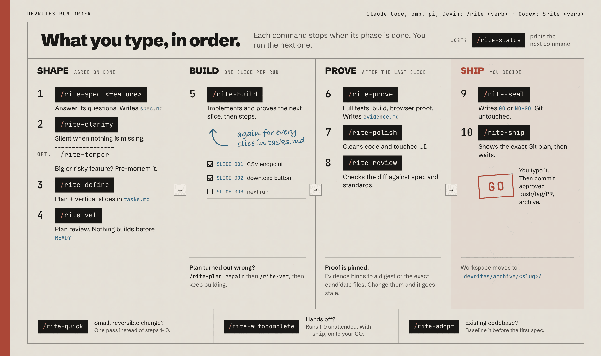

<p align="center">
  <a href="https://devrites.com">
    
  </a>
</p>

<p align="center">
  <a href="https://www.npmjs.com/package/devrites"></a>
  <a href="#hosts"></a>
  
  <a href="LICENSE"></a>
</p>

<p align="center">
  <a href="https://devrites.com"><b>Website</b></a> ·
  <a href="docs/quick-reference.md"><b>Quick reference</b></a> ·
  <a href="docs/command-map.md"><b>Command map</b></a> ·
  <a href="docs/usage.md"><b>Worked examples</b></a> ·
  <a href="CHANGELOG.md"><b>Changelog</b></a>
</p>

<br>

DevRites is a repository-local workflow for AI coding agents. It turns a
feature request into a spec, a sliced plan, working code, recorded proof, a
release decision, and an explicit ship step. It runs inside Claude Code, Codex,
omp, pi, and Devin CLI.

DevRites keeps that work in `.devrites/` inside your repository, where chat
history can't lose it. After you clear the conversation, switch hosts, or hand
the feature to another engineer, the next session reads the same plan,
decisions, and evidence before it continues.

**Status:** [`v5.13.1`](https://github.com/ViktorsBaikers/DevRites/releases/tag/v5.13.1): see [`CHANGELOG.md`](CHANGELOG.md) for release notes.

This is the latest published release; `main` may contain unreleased work.

## Why DevRites

| Without a workflow | With DevRites |
| --- | --- |
| The plan lives in a chat window and disappears on `/clear`. | Spec, plan, decisions, and questions are Markdown files in `.devrites/work/<slug>/`. |
| The agent says "tests pass". | Proof must be positive and discriminating, and it is bound to a digest of the exact candidate files. |
| The agent that wrote the code also reviews it. | Seventeen fresh-context specialist agents plan, review, audit, and prove. Only one of them can write code. |
| Commits and pushes happen whenever the agent decides. | Seal decides `GO` or `NO-GO`. Ship acts only after you type a fresh, literal `GO`. |
| Every change gets the same ceremony. | `/rite-quick` handles a small reversible change. The full lifecycle is for features and risky work. |

## Quick start

**1. Install** from the root of your project. Node.js 18 or later is required.

```bash
npx devrites@latest
```

The installer adds project-local support for Claude Code, Codex, omp, pi, and
Devin CLI. It does not write skills, agents, or hooks to `~/.claude`,
`~/.codex`, `~/.pi`, or `~/.config/devin`.

**2. Pick the smallest route** that still protects the work.

| You want to… | Claude Code, omp, pi, Devin | Codex |
| --- | --- | --- |
| Make a small, reversible change | `/rite-quick fix the CSV header typo` | `$rite-quick fix the CSV header typo` |
| Build a new feature or risky behavior | `/rite-spec add-csv-export` | `$rite-spec add-csv-export` |
| Resume an active feature | `/rite-status` | `$rite-status` |
| Baseline an existing codebase | `/rite-adopt` | `$rite-adopt` |
| Run the whole lifecycle unattended | `/rite-autocomplete` | `$rite-autocomplete` |

**3. Follow the next recorded step.** `/rite-status` reads the active workspace
and reports the phase, open questions, evidence, and the next command.

> [!TIP]
> The shortest path is Spec, Build, Prove. Clarify and Vet still run, but
> they ask nothing when the contract is already complete.

## The lifecycle

<p align="center">
  
</p>

In the default HITL mode, you run each command yourself, in this order. Each
one stops when its phase is done and records the next step in the workspace.
If you lose track, `/rite-status` prints the next command.

```text
/rite-spec add-csv-export   #  1  answer its questions; writes spec.md
/rite-clarify               #  2  asks nothing when the spec is complete
/rite-temper                #     optional: big or risky features only
/rite-define                #  3  plan + vertical slices in tasks.md
/rite-vet                   #  4  plan review; nothing builds before READY
/rite-build                 #  5  builds slice 1, then stops
/rite-build                 #  5  builds slice 2; repeat until every slice is done
/rite-prove                 #  6  once, after the last slice
/rite-polish                #  7  cleans code and touched UI
/rite-review                #  8  checks the diff against spec and standards
/rite-seal                  #  9  GO or NO-GO; Git untouched
/rite-ship                  # 10  shows the exact Git plan, then waits for you to type GO
```

Every command has four equivalent forms: `/rite <verb>` and `/rite-<verb>` in
Claude Code, omp, pi, and Devin CLI, and `$rite <verb>` and `$rite-<verb>` in
Codex. On pi, commands run as prompt templates under `.pi/prompts`; on omp,
as command stubs under `.omp/commands`. On both, `/skill:rite-<verb>` is
equivalent.

### Shape (steps 1 to 4): agree on what "done" means

| # | Command | What it does | Leaves behind |
| :-: | --- | --- | --- |
| **1** | [`/rite-spec <feature>`](pack/.claude/skills/rite-spec/SKILL.md) | Inspects the request and the codebase, asks about product gaps, and writes a lossless contract with an explicit capability impact. | `spec.md` |
| **2** | [`/rite-clarify`](pack/.claude/skills/rite-clarify/SKILL.md) | Checks the whole feature for missing decisions. Mandatory, but asks nothing when everything is clear. | `decision-coverage.md` |
| opt. | [`/rite-temper`](pack/.claude/skills/rite-temper/SKILL.md) | Challenges scope, premise, and failure modes with a pre-mortem. Skip it for small work; Autocomplete always runs it. | `strategy.md` |
| **3** | [`/rite-define`](pack/.claude/skills/rite-define/SKILL.md) | Turns the approved spec into architecture, traceability, and vertical task slices. | `plan.md`, `tasks.md` |
| **4** | [`/rite-vet`](pack/.claude/skills/rite-vet/SKILL.md) | Reviews every plan before code, with review depth scaled to risk. Build cannot start until Vet passes. | `eng-review.md`, `test-plan.md` |

### Build (step 5): one slice per run

| # | Command | What it does | Leaves behind |
| :-: | --- | --- | --- |
| **5** | [`/rite-build`](pack/.claude/skills/rite-build/SKILL.md) | Implements and verifies the next slice, then stops. Run it again until every slice in `tasks.md` is built. With `.devrites/AFK`, it may chain low-risk slices under a cap. | `touched-files.md`, `evidence.md` |
| if needed | [`/rite-plan repair`](pack/.claude/skills/rite-plan/SKILL.md) | The plan turned out wrong: reslices, reorders, or unblocks it. Run `/rite-vet` again, then keep building. | `plan.md`, `tasks.md` |
| if needed | [`/rite-converge`](pack/.claude/skills/rite-converge/SKILL.md) | Resuming a half-built feature: compares live code with recorded intent, adds missing slices, and sends the plan back to Vet. | `convergence-assessment.md`, `tasks.md` |

### Prove (steps 6 to 8): once, after the last slice

| # | Command | What it does | Leaves behind |
| :-: | --- | --- | --- |
| **6** | [`/rite-prove`](pack/.claude/skills/rite-prove/SKILL.md) | Runs positive, discriminating tests plus build, runtime, and UI checks, then binds the evidence to the candidate digest. | `evidence.md`, `browser-evidence.md` |
| **7** | [`/rite-polish`](pack/.claude/skills/rite-polish/SKILL.md) | Cleans up the candidate, normalizes touched UI, completes durable rollups, and refreshes affected proof. | `polish-report.md` |
| **8** | [`/rite-review`](pack/.claude/skills/rite-review/SKILL.md) | Reviews the closed candidate against its spec and engineering standards. | `review.md` |

### Ship (steps 9 and 10): you decide

| # | Command | What it does | Leaves behind |
| :-: | --- | --- | --- |
| **9** | [`/rite-seal`](pack/.claude/skills/rite-seal/SKILL.md) | Rechecks candidate-bound evidence and writes the final `GO` or `NO-GO` without changing Git. | `seal.md` |
| **10** | [`/rite-ship`](pack/.claude/skills/rite-ship/SKILL.md) | Runs a read-only preflight and shows the exact Git plan. After you type a fresh literal `GO`, it commits, runs any approved push, tag, or PR action, and archives the workspace. | `ship.md`, `archive/<slug>/` |

<details>
<summary><b>Other routes and utilities</b></summary>

<br>

| Command | Use it to… |
| --- | --- |
| [`/rite`](pack/.claude/skills/rite/SKILL.md) | Show the command menu, or route a verb. |
| [`/rite-quick`](pack/.claude/skills/rite-quick/SKILL.md) | Ship a small, reversible change with a compact contract, focused proof, and scope review. Escalates to `/rite-spec` when the work stops being small. |
| [`/rite-autocomplete`](pack/.claude/skills/rite-autocomplete/SKILL.md) | Run the reversible lifecycle unattended and stop at Seal `GO`. With `--ship`, continue through Ship preflight and wait for your literal `GO`. |
| [`/rite-adopt`](pack/.claude/skills/rite-adopt/SKILL.md) | Reverse-engineer current behavior of an existing codebase into a baseline workspace. |
| [`/rite-upgrade [slug]`](pack/.claude/skills/rite-upgrade/SKILL.md) | Reconcile an older active workspace with current contracts. Routes only evidence-backed defects to their phase owners. |
| [`/rite-status`](pack/.claude/skills/rite-status/SKILL.md) | Report phase, active slice, next action, evidence, open questions, and risks. Read-only. |
| [`/rite-resolve <qid> "<answer>"`](pack/.claude/skills/rite-resolve/SKILL.md) | Answer, drop, or batch-resolve open questions. |
| [`/rite-handoff`](pack/.claude/skills/rite-handoff/SKILL.md) | Sync chat-only context into `.devrites/` and write a fresh-agent handoff. |
| [`/rite-frame`](pack/.claude/skills/rite-frame/SKILL.md) | Frame an underspecified ask before coding, then audit the diff. |
| [`/rite-pressure-test`](pack/.claude/skills/rite-pressure-test/SKILL.md) | Explore three to five radically different approaches to a rough idea before Spec. |
| [`/rite-prototype`](pack/.claude/skills/rite-prototype/SKILL.md) | Build a throwaway prototype to answer one logic or UI question. |
| [`/rite-pov`](pack/.claude/skills/rite-pov/SKILL.md) | Get a project-grounded verdict on a library, platform, CVE, or pattern. |
| [`/rite-zoom-out`](pack/.claude/skills/rite-zoom-out/SKILL.md) | Map unfamiliar code: modules, callers, callees, and relevant decisions. |
| [`/rite-explain`](pack/.claude/skills/rite-explain/SKILL.md) | Learn one concept, diff, or recent change, with an optional check-in. |
| [`/rite-dogfood`](pack/.claude/skills/rite-dogfood/SKILL.md) | Run explicit browser QA for the active feature or branch. |
| [`/rite-pr-feedback`](pack/.claude/skills/rite-pr-feedback/SKILL.md) | Resolve GitHub PR review feedback. |
| [`/rite-watch-pr`](pack/.claude/skills/rite-watch-pr/SKILL.md) | Watch one PR and its CI state without mutating anything. |
| [`/rite-learn`](pack/.claude/skills/rite-learn/SKILL.md) | Turn recurring cross-feature evidence into durable project guidance. |
| [`/rite-customize`](pack/.claude/skills/rite-customize/SKILL.md) | Customize a project instruction, skill, agent, plugin, or legacy import. |
| [`/rite-doctor`](pack/.claude/skills/rite-doctor/SKILL.md) | Check the DevRites install, pack, or host configuration. |
| [`/overhaul`](pack/.claude/skills/overhaul/SKILL.md) | Run an approval-gated overhaul of a project, PR, or branch. Works without a DevRites workspace; explicit invocation only. |

</details>

The [command map](docs/command-map.md) covers every command, trigger, input,
and output. The [worked examples](docs/usage.md) cover normal features, plan
drift, UI work, backend work, and mid-flight handoffs.

## What DevRites records

Each feature gets a directory under `.devrites/work/<slug>/`. Shipped
workspaces move intact to `.devrites/archive/<slug>/`, so future work can
inspect the original decisions and proof.

```text
.devrites/
├── ACTIVE                  active feature slug
├── AFK                     optional unattended-mode configuration
├── principles.md           project rules that gate the workflow
├── specs/                  living structured capabilities
├── work/<slug>/
│   ├── brief.md  spec.md  decision-coverage.md
│   ├── architecture.md  plan.md  tasks.md  eng-review.md  test-plan.md
│   ├── state.md  decisions.md  questions.md  traceability.md
│   ├── evidence.md  touched-files.md      strict project-candidate manifest
│   └── review.md  seal.md  ship.md
└── archive/<slug>/
```

`.devrites/CHECKPOINT` is a reserved path, not a commit gate. Some phases add
focused artifacts such as `strategy.md`, `design-brief.md`,
`browser-evidence.md`, `polish-report.md`, `drift.md`, or `handoff.md`. See the
[workspace contract](docs/engine/workspace-schema.md) for the full state model
and [candidate integrity](docs/candidate-integrity.md) for the Build-to-Ship
content binding.

## Safety rules

- **Settle before code.** Spec and Clarify settle the behavior contract. Define
  and Vet settle the implementation path before Build starts. The active skill
  and exact native reviewers judge `CLEAR`, `READY`, traceability, and test
  quality; the engine checks phase-relative structure and, after Vet, the exact
  Build-input binding.
- **Bound every Build dispatch.** Before each writer dispatch, the root names
  the exact project-relative paths in the task. After return, it rejects any
  extra path in `git diff --name-only`, reviews test integrity, and runs
  repository proof.
- **Classify drift before routing.** The Spec Drift Guard records a mismatch in
  `drift.md`. Build handles objective failures with bounded recovery, uses
  `/rite-plan repair` only when the durable plan is wrong, and asks you only
  for a real product or risk decision.
- **Prove claims.** Skipped, zero-test, assertion-free, tautological,
  unexecuted, or exit-only results do not prove behavior. Static gates prove
  only their static criterion. A screenshot path by itself is not proof.
- **Separate the decision from the action.** Seal makes the release decision.
  Ship performs Git actions only after the seal passes and you type `GO`.
- **Stay inside the feature.** Review, security, simplification, and polish do
  not expand into unrelated project cleanup.

Validated project principles and nearest-scope repository instructions govern
product and technical choices. They do not grant permission or waive DevRites
safety, source-writing, or evidence gates. A feature can record a deliberate,
scoped exception instead of silently ignoring a principle. The canonical order
is in [`core.md` § Precedence](pack/.claude/skills/devrites-lib/reference/standards/core.md#precedence).

## HITL and AFK

| | **HITL** (default) | **AFK** (opt-in) |
| --- | --- | --- |
| Turn on | Nothing to do. | Create `.devrites/AFK`. Delete it to return to HITL. |
| Decisions | Ranked options; your answer is recorded in the workspace. | Permitted gates pick the recommended option and continue. |
| Build | One vertical slice per run. | Chains low-risk slices within `max_slices` and pause rules. |
| Unanswered question | Stays in `questions.md`; answer later with `/rite-resolve`. | Pauses for product, scope, policy, irreversible risk, or human-only access. |
| Git | Ship always waits for a fresh literal `GO`. | Same. Local WIP checkpoint commits stay local unless Ship's disclosed plan includes an approved remote action. |

```yaml
# .devrites/AFK
max_slices: 10
max_agents: 32
max_minutes: 120
max_review_queue: 8
allow_gates: [advisory]
```

The workflow treats this file as configuration and never rewrites it.
`max_slices` seeds the remaining budget in the feature's `state.md`; the root
charges it once per green slice and stops at zero. Unattended slice work also
requires valid `max_agents`, `max_minutes`, and `max_review_queue`; a missing
or malformed value fails closed.

`/rite-autocomplete` also auto-resolves blocking questions that already name a
ranked recommended option. Escalating, irreversible-risk, access, and
no-recommendation questions still pause. When bounded recovery runs out,
agents record a technical blocker instead of asking you. The full contract is
in [`afk-hitl.md`](pack/.claude/skills/devrites-lib/reference/standards/afk-hitl.md).

## Install, update, and remove

```bash
npx devrites@latest                      # install in the current project
npx devrites@latest --target /path/to/project
npx devrites@latest --dry-run            # preview file operations

npx devrites@latest update               # update engine and pack
npx devrites@latest update --check
devrites-engine update                   # same, from an installed project

npx devrites@latest uninstall
npx devrites@latest uninstall --keep-binary
```

Run `npx devrites@latest --help` for common flags and
`npx devrites@latest <command> --help` for command-specific flags.

<details>
<summary><b>Install flags</b></summary>

<br>

| Flag | Effect |
| --- | --- |
| `--target DIR` | Use another project directory. |
| `--dry-run` | Show planned file operations without changing anything. |
| `--force` | Replace or remove foreign or customized managed files. The installer still rejects symlinks and path escapes. |
| `--no-codex` | Skip `.agents`, `.codex`, and the Codex `AGENTS.md` block. |
| `--no-omp` | Skip `.omp` skills, agents, and command stubs. |
| `--no-pi` | Skip `.pi` skills, agents, prompt commands, and the pi `AGENTS.md` block. |
| `--no-devin` | Skip `.devin` skills, agents, and the Devin `AGENTS.md` block. |
| `--no-agents` | Skip hook-free native specialist profiles. |
| `--no-skills` | Skip skills and their bundled standards. |
| `--no-binary` | Do not keep the shared `devrites-engine` binary in a user or system bin directory. |
| `--short-aliases=all` | Add `/define`, `/build`, `/prove`, and `/seal` aliases. |

</details>

<details>
<summary><b>Install without Node.js (verified Bash bootstrap)</b></summary>

<br>

Download the release-owned installer and its checksum before executing it. It
needs `curl`, `gzip`, and `tar`.

```bash
bootstrap_dir="$(mktemp -d)"
(
  set -e
  trap 'rm -rf "$bootstrap_dir"' EXIT HUP INT TERM
  cd "$bootstrap_dir"
  release=https://github.com/ViktorsBaikers/DevRites/releases/latest/download
  curl -fL --proto '=https' --proto-redir '=https' --connect-timeout 10 --max-time 60 --max-filesize 1048576 "$release/install.sh" | head -c 1048577 > install.sh
  install_status="${PIPESTATUS[0]}"
  [ "$(wc -c < install.sh)" -le 1048576 ] || { echo 'error: install.sh exceeds 1 MiB' >&2; exit 1; }
  [ "$install_status" -eq 0 ] || { echo 'error: install.sh download failed' >&2; exit 1; }
  curl -fL --proto '=https' --proto-redir '=https' --connect-timeout 10 --max-time 30 --max-filesize 4096 "$release/install.sh.sha256" | head -c 4097 > install.sh.sha256
  sidecar_status="${PIPESTATUS[0]}"
  [ "$(wc -c < install.sh.sha256)" -le 4096 ] || { echo 'error: install.sh.sha256 exceeds 4 KiB' >&2; exit 1; }
  [ "$sidecar_status" -eq 0 ] || { echo 'error: install.sh.sha256 download failed' >&2; exit 1; }
  want="$(awk '
    NF == 0 { next }
    { records++ }
    NF == 2 && length($1) == 64 && $1 ~ /^[0-9A-Fa-f]+$/ && $2 == "install.sh" { valid++; hash=tolower($1) }
    END { if (records == 1 && valid == 1) print hash; else exit 1 }
  ' install.sh.sha256)"
  if command -v shasum >/dev/null 2>&1; then
    got="$(shasum -a 256 install.sh | awk '{print $1}')"
  elif command -v sha256sum >/dev/null 2>&1; then
    got="$(sha256sum install.sh | awk '{print $1}')"
  else
    echo 'error: shasum or sha256sum is required' >&2
    exit 1
  fi
  [ "$got" = "$want" ] || { echo 'error: install.sh checksum mismatch' >&2; exit 1; }

  # Choose one Node-free operation:
  bash ./install.sh                         # install here
  # bash ./install.sh --target /path/to/project
  # bash ./install.sh --dry-run
  # bash ./install.sh update
  # bash ./install.sh uninstall
)
```

To pin a named release, replace `latest/download` with
`download/v<version>` and run the chosen operation with
`DEVRITES_REF=v<version>`. Existing local or extracted `install.sh`,
`update.sh`, and `uninstall.sh` invocations remain compatible. The
exact-release acquisition guarantee begins with the verified release
`install.sh`; mutable default-branch scripts are not an installation boundary.

</details>

<details>
<summary><b>How install, update, and uninstall protect your files</b></summary>

<br>

The installer records every managed project file and its SHA-256 in
`.claude/devrites.manifest`. Before an update or uninstall changes anything, it
checks every managed path. It preserves customized files and tells you to retry
with `--force`; legacy manifests without hashes also require `--force`.
`--force --dry-run` lists the exact destructive actions. Marker-merged files
keep user content outside the DevRites block, and `.devrites/` runtime state
stays in place. The installer refuses symlinks, junctions, and paths that
escape the target.

The optional shared `devrites-engine` binary is the only artifact installed
outside the project. Before replacement, the staged release binary must report
the requested version; after installation, the binary at its final path must
report it again in a new process. The installer keeps a backup until the
second check passes and restores it on failure.

`devrites-engine update` resolves the latest stable release, acquires its
bundle and platform binary, and hands local paths to the downloaded engine, so
the candidate engine validates its own payload before replacing the installed
pack and binary. `update --check` compares versions without downloading
release assets. If an older engine reports `missing codex/hooks.json` or asks
for `--source-dir`, use the npm or verified shell route once to reach a
release with the self-contained updater.

`/rite-upgrade` is the separate, preservation-first route for reconciling an
unfinished workspace; it never migrates cursor format or invents historical
proof. `devrites-engine migrate` owns deterministic v5 schema normalization.
See the [CLI contract](docs/cli.md) and
[ADR-0029](docs/adr/0029-v5-workspace-schema-and-native-migration.md).

Release binaries and installers ship with SHA-256 sidecars and
build-provenance attestations. Verify a download with
`shasum -a 256 -c <file>.sha256` or
`gh attestation verify <file> -R ViktorsBaikers/DevRites --signer-workflow ViktorsBaikers/DevRites/.github/workflows/ci.yml@refs/heads/main`.
Pin the signer workflow, because valid provenance shows where a build ran
but does not show that the intended publishing step produced it. See
[docs/release.md](docs/release.md).

</details>

## Hosts

| Host | Skills | Agents | Also installs | Invoke |
| --- | --- | --- | --- | --- |
| **Claude Code** | `.claude/skills/` | `.claude/agents/` | Native root permissions merged into `.claude/settings.json` | `/rite-spec` |
| **Codex** | `.agents/skills/` | `.codex/agents/` | Permissions in `.codex/config.toml`, marked block in `AGENTS.md` | `$rite-spec` or `/skills` |
| **omp** | `.omp/skills/` | `.omp/agents/` | Command stubs in `.omp/commands/` | `/rite-spec` or `/skill:rite-spec` |
| **pi** | `.pi/skills/` | `.pi/agents/` | Prompt commands in `.pi/prompts/`, marked block in `AGENTS.md` | `/rite-spec` or `/skill:rite-spec` |
| **Devin CLI** | `.devin/skills/` | `.devin/agents/` | Marked block in `AGENTS.md` | `/rite-spec` |

On every host, `devrites-slice-wright` is the only writable specialist, and
every other specialist is read-only and hook-free. Existing
settings and user content stay in place. On Devin CLI, dispatch goes through
`run_subagent` with the exact `devrites-<role>` profile, and a missing profile
stops for HITL instead of substituting `subagent_general`. Profiles load when a
session starts, so reopen the project after installing.

DevRites is installed through npm or the Bash bootstrap. It is not distributed
through Claude Code or Codex plugin stores.

## Skills and agents

The pack ships 45 skills: 34 public and 11 internal. The public surface
contains the `rite` menu, 32 `rite-*` workflows and utilities, and the
standalone, explicit-only `/overhaul`. Ten `devrites-*` specialists load when a
matching task needs them; `devrites-lib` carries the shared contracts and
engineering standards.

Seventeen fresh-context agent profiles ship with the pack: sixteen read-only
roles plus `devrites-slice-wright`, the sole source and test writer. Codex,
omp, pi, and Devin generate the same one-writer, sixteen-reader split.
`/overhaul` adds eight `overhaul-*` agents that only it dispatches; they keep
every tool ([ADR-0031](docs/adr/0031-overhaul-agents-keep-every-tool.md)).

The [skills catalogue](docs/skills.md) lists every skill and agent. The
[flow diagrams](docs/flow.md) show routing, reviewer fan-out, and namespace
boundaries.

## Engineering standards and UI work

Stack-agnostic standards live under
`.claude/skills/devrites-lib/reference/standards/`. Lifecycle skills load the
small core first, then only the standards they need. Nearest project
instructions override generic advice, and ratified `.devrites/principles.md`
are gating invariants. The
[standards index](pack/.claude/skills/devrites-lib/reference/standards/README.md)
maps each rule file to the phases that use it.

For UI work, Spec records the visual direction and required states in
`design-brief.md`, Build follows the project's existing design system, and
Prove collects runtime and browser evidence. The guidance checks WCAG 2.2 AA
and, when performance is measurable, targets LCP ≤ 2.5 s, INP ≤ 200 ms, and
CLS ≤ 0.1. Full-stack work starts with the API and data contract, then builds
a vertical slice through the UI.

DevRites works without extra tools. When available, codegraph or graphify can
answer structural questions,
[Playwright MCP](https://github.com/microsoft/playwright-mcp) can collect
browser evidence, and Chrome DevTools MCP can add Lighthouse and performance
traces. DevRites detects these tools but does not install them.

## Security model

- Installed host artifacts stay in the project. Use `--no-binary` or
  `DEVRITES_NO_BINARY=1` to avoid keeping a shared binary outside it.
- npm, Bash, and `devrites-engine update` all require checksummed release
  assets. Remote fetches use HTTPS at every redirect hop, are bounded in size,
  and never fall back to an unchecked raw file, source archive, tag, or default
  branch.
- Install, update, and uninstall do not inspect target-project Git. Retained
  safety operations such as `secret-scan --staged` read only the exact index
  and staged blobs they validate.
- Production Git calls strip `GIT_*` variables that could retarget them. Seal
  binds proof, review, and verdict to the strict project candidate rather than
  to modification times
  ([ADR-0026](docs/adr/0026-content-bound-proof-and-bounded-inputs.md)).
- The installer never writes `defaultMode: bypassPermissions`. Skills use
  networked research only through host tools you invoke or configure.

Read [`SECURITY.md`](SECURITY.md) for the threat model, managed deployment
guidance, and private reporting instructions.

## Contributing

```text
bin/               npm CLI shim
engine/            Go control plane and tests
pack/.claude/      canonical skills, agents, permissions, and standards
pack/generated/    generated host payloads; do not edit by hand
scripts/           validation, generation, install, and release tooling
tests/             repository-level shell tests
docs/              architecture, usage, command, and contributor guides
evals/             routing and behavioral evaluation fixtures
```

```bash
npm install
npm run validate
npm test
(cd engine && go test ./... -count=1)
```

Canonical pack changes belong in `pack/.claude/`. Rebuild host payloads with
`bash scripts/build-host-artifacts.sh` instead of editing `pack/generated/`.
See [`CONTRIBUTING.md`](CONTRIBUTING.md) for the development workflow and
review requirements, and the [code of conduct](CODE_OF_CONDUCT.md) before
opening a change. Maintainer ownership is in [`CODEOWNERS`](CODEOWNERS);
third-party notices are in [`NOTICE.md`](NOTICE.md).

<details>
<summary><b>All documentation</b></summary>

<br>

- [Quick reference](docs/quick-reference.md)
- [Worked examples](docs/usage.md)
- [Command map](docs/command-map.md)
- [Skills catalogue](docs/skills.md)
- [Architecture](docs/architecture.md)
- [Lifecycle diagrams](docs/flow.md)
- [Candidate integrity](docs/candidate-integrity.md)
- [Engine CLI](docs/cli.md)
- [Release process](docs/release.md)
- [Nine-source workflow benchmark snapshot (2026-08-01; historical, non-authoritative)](docs/upstream-workflow-benchmark-2026-08-01.md)
- [Markdown instruction upgrade snapshot (2026-08-02; historical, non-authoritative)](docs/markdown-instruction-upgrade-2026-08-02.md)
- [ADR-0026: content-bound proof and bounded inputs](docs/adr/0026-content-bound-proof-and-bounded-inputs.md)
- [Changelog](CHANGELOG.md)
- [Releases](https://github.com/ViktorsBaikers/DevRites/releases)

</details>

## License

DevRites is source-available software for personal use with Claude Code and
Codex. Distribution, modified distribution, fork mirrors, and commercial or
organizational use require approval. Read [`LICENSE`](LICENSE) for the full
terms.

<p align="center">
  <sub>Spec → proof → people → better software.</sub>
</p>
