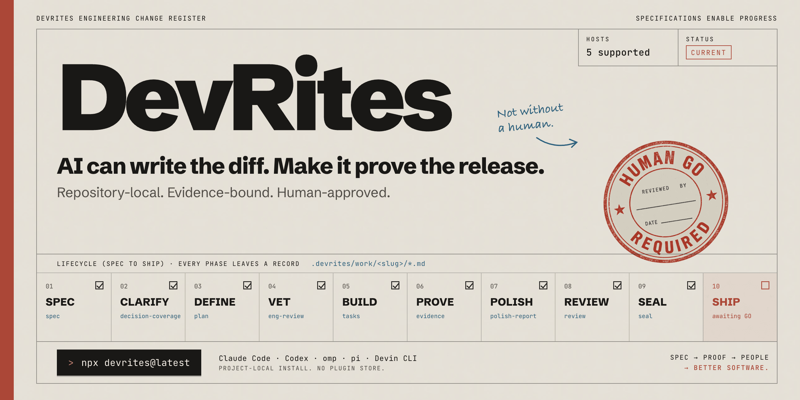

<p align="center">
  
</p>

# DevRites

DevRites is a repository-local workflow for building software with Claude Code
or Codex. It turns a feature request into a spec, a sliced plan, working code,
recorded proof, a release decision, and an explicit ship step.

The work lives under `.devrites/`, not in chat history. A later session or a
different agent can read the same plan, decisions, state, and evidence before it
continues.

The core path is:

`SPEC -> CLARIFY -> [TEMPER] -> DEFINE -> VET -> BUILD -> PROVE -> POLISH -> REVIEW -> SEAL -> SHIP`

Clarify is mandatory but adaptive, so it asks no questions when the contract
is complete. Temper adds an optional strategic review. Vet is the only final
readiness phase before Build.

Seal decides whether the feature is ready without changing git. Ship owns the
final commit, push, and tag, and it requires a typed `GO` confirmation.
Unattended runs may create local WIP checkpoint commits along the way, but only
Ship collapses and pushes them.

**Status:** [`v3.2.4`](https://github.com/ViktorsBaikers/DevRites/releases/tag/v3.2.4): see [`CHANGELOG.md`](CHANGELOG.md) for release notes.

## Quick start

### 1. Install DevRites

Run this from the root of your project. Node.js 18 or later is required.

```bash
npx devrites@latest
```

The installer adds project-local support for Claude Code and Codex. It does not
write skills, agents, or hooks to `~/.claude` or `~/.codex`.

### 2. Start a feature

In Claude Code:

```text
/rite-spec add-csv-export
```

In Codex:

```text
$rite-spec add-csv-export
```

DevRites investigates the repository, asks about gaps, and writes the feature
spec under `.devrites/work/add-csv-export/`. For an existing codebase that needs
an onboarding pass first, use `/rite-adopt` in Claude Code or `$rite-adopt` in
Codex.

### 3. Follow the next recorded step

Use `/rite-status` in Claude Code or `$rite-status` in Codex. Status reads the
active workspace and reports the current phase, open questions, evidence, and
next command.

## How the lifecycle works

Claude Code supports both `/rite <verb>` and `/rite-<verb>`. Codex uses the same
forms with `$`: `$rite <verb>` and `$rite-<verb>`. The menu and direct forms run
the same skill.

| # | Stage | Direct command | What happens |
|---:|---|---|---|
| 1 | Spec | [`/rite-spec <feature>`](pack/.claude/skills/rite-spec/SKILL.md) | Inspects the request and codebase, asks about product gaps, and writes `spec.md`. |
| 2 | Clarify | [`/rite-clarify`](pack/.claude/skills/rite-clarify/SKILL.md) | Checks the whole feature for missing decisions before planning. It asks no questions when everything is clear. |
| 3 | Temper | [`/rite-temper`](pack/.claude/skills/rite-temper/SKILL.md) | Challenges scope and failure modes before Define. It is optional for small work and always runs in `/rite-autocomplete`. |
| 4 | Define | [`/rite-define`](pack/.claude/skills/rite-define/SKILL.md) | Turns the approved spec into architecture, a plan, traceability, and vertical task slices. |
| 5 | Vet | [`/rite-vet`](pack/.claude/skills/rite-vet/SKILL.md) | Reviews every plan before implementation. The review depth scales with the risk. |
| 6 | Build | [`/rite-build`](pack/.claude/skills/rite-build/SKILL.md) | Implements and verifies one slice, then stops. Run it again for each remaining slice. |
| 7 | Converge | [`/rite-converge`](pack/.claude/skills/rite-converge/SKILL.md) | Runs only when recovery is needed. It compares the code with the recorded intent, adds missing slices, and sends the changed plan back to Vet. |
| 8 | Prove | [`/rite-prove`](pack/.claude/skills/rite-prove/SKILL.md) | Runs the completed feature's tests, build, runtime checks, and browser proof when the feature has a UI. |
| 9 | Polish | [`/rite-polish`](pack/.claude/skills/rite-polish/SKILL.md) | Cleans up the touched code and normalizes the UI when needed. |
| 10 | Review | [`/rite-review`](pack/.claude/skills/rite-review/SKILL.md) | Reviews the completed feature against its spec and engineering standards. |
| 11 | Seal | [`/rite-seal`](pack/.claude/skills/rite-seal/SKILL.md) | Writes the final `GO` or `NO-GO` decision without changing git. |
| 12 | Ship | [`/rite-ship`](pack/.claude/skills/rite-ship/SKILL.md) | On `GO`, asks for typed confirmation, performs the approved git actions, and archives the workspace. |
| n/a | Upgrade *(conditional)* | [`/rite-upgrade [slug]`](pack/.claude/skills/rite-upgrade/SKILL.md) | Brings an active unfinished workspace onto the current planning contract without rewriting completed work or evidence. Build readiness sends stale workspaces here automatically. |

Some work needs a different route:

- [`/rite-quick`](pack/.claude/skills/rite-quick/SKILL.md) handles a small,
  reversible change without creating a full feature workspace.
- [`/rite-autocomplete`](pack/.claude/skills/rite-autocomplete/SKILL.md) runs
  the lifecycle unattended. With `--ship`, it auto-confirms the final typed
  `GO`; without that flag, it stops and waits for you.
- [`/rite-upgrade [slug]`](pack/.claude/skills/rite-upgrade/SKILL.md) is a
  maintenance route for an active workspace planned under older DevRites
  rules. It is not a mandatory lifecycle phase.
- [`/rite`](pack/.claude/skills/rite/SKILL.md) shows the command menu.

`devrites-engine update` refreshes the installed engine and pack.
`devrites-engine migrate` normalizes workspace layout and structural state.
Neither replaces `/rite-upgrade`, which reconciles unfinished planning
semantics while preserving completed work.

The [command map](docs/command-map.md) covers every command, trigger, input, and
output. The [worked examples](docs/usage.md) show normal features, plan drift,
UI work, backend work, and mid-flight handoffs.

## What DevRites records

Each feature gets a directory under `.devrites/work/<slug>/`. Shipped
workspaces move intact to `.devrites/archive/<slug>/` so future work can inspect
the original decisions and proof.

```text
.devrites/
  ACTIVE                 # active feature slug
  AFK                    # optional unattended-mode configuration
  principles.md          # project rules that gate the workflow
  conventions.md         # observed project patterns
  learnings.md           # recurring lessons and known false positives
  work/<slug>/
    brief.md
    spec.md
    decision-coverage.md
    architecture.md
    plan.md
    tasks.md
    eng-review.md
    test-plan.md
    state.md
    decisions.md
    questions.md
    traceability.md
    evidence.md
    review.md
    seal.md
    ship.md
  archive/<slug>/
```

Some phases add focused artifacts such as `strategy.md`, `design-brief.md`,
`browser-evidence.md`, `polish-report.md`, `drift.md`, or `handoff.md`. See the
[workspace contract](docs/engine/workspace-schema.md) for the full state model.

## Safety rules

- **Settle before code.** Spec and Clarify settle the behavior contract. Define
  and Vet settle the implementation path before Build starts. The engine checks
  the meaning and input digests of fresh `CLEAR` and `READY` artifacts; marker
  text alone does not pass.
- **Build one slice.** `/rite-build` implements one vertical slice and records
  its proof before returning control. Before dispatching the sole writer, the
  root writes an exact `.wright-allowlist`. Reconciliation and integrity gates
  use the same pre-slice baseline.
- **Classify drift before routing.** The Spec Drift Guard records the mismatch
  in `drift.md`. Build handles objective implementation and tool failures with
  bounded recovery; it uses
  [`/rite-plan repair`](pack/.claude/skills/rite-plan/SKILL.md) only when the
  durable plan is wrong, and asks you only for a real product or risk decision.
- **Prove claims.** Tests, commands, output, and opened screenshots support
  completion claims. A screenshot path by itself is not proof.
- **Separate the decision from the action.** Seal makes the release decision.
  Ship performs the final git actions only after the seal passes and you type
  `GO`.
- **Stay inside the feature.** Review, security, simplification, and polish do
  not expand into unrelated project cleanup.

Project principles in `.devrites/principles.md` take precedence over learned
conventions and the bundled engineering standards. A feature can record a
deliberate exception instead of silently ignoring a project rule.

## HITL and AFK modes

### HITL is the default

When DevRites needs a decision, it presents ranked options, records the chosen
answer in the workspace, and continues. If the current turn must stop, the
question remains in `questions.md`; answer it later with
[`/rite-resolve <qid> "<answer>"`](pack/.claude/skills/rite-resolve/SKILL.md).
Codex uses the equivalent `$rite-resolve` form.

### AFK runs the safe part unattended

Create `.devrites/AFK` to let permitted gates select their recommended option
and continue:

```yaml
max_slices: 10
allow_gates: [advisory]
```

The workflow treats this file as configuration and never rewrites it.
`max_slices` seeds the remaining budget in the active feature's `state.md`; the
engine decrements that state after each built slice. Delete `.devrites/AFK` to
return to HITL.

AFK still pauses for product, scope, or policy choices, irreversible risk,
and access or actions available only to a human. Agents use bounded recovery
for red tests, type or lint errors, runtime failures, and missing technical
coverage. If that recovery budget runs out, they record a technical blocker
instead of asking a question. The full pause and gate contract is in
[`afk-hitl.md`](pack/.claude/skills/devrites-lib/reference/standards/afk-hitl.md).

## Install, update, and remove

### npm

```bash
# Install in the current project
npx devrites@latest

# Install elsewhere or preview the changes
npx devrites@latest --target /path/to/project
npx devrites@latest --dry-run

# Update or remove an existing installation
npx devrites@latest update
npx devrites@latest uninstall
```

Useful install flags:

| Flag | Effect |
|---|---|
| `--target DIR` | Use another project directory. |
| `--dry-run` | Show planned file operations without changing anything. |
| `--force` | Replace or remove foreign or customized managed files. The installer still rejects symlinks and path escapes. |
| `--no-codex` | Skip `.agents`, `.codex`, and `AGENTS.md` integration. |
| `--no-agents` | Skip the review agents. |
| `--no-skills` | Skip skills and their bundled standards. |
| `--no-binary` | Do not keep the shared `devrites-engine` binary in a user or system bin directory. |
| `--short-aliases=all` | Add `/define`, `/build`, `/prove`, and `/seal` aliases. |

Run `npx devrites@latest --help` for the full option list.

### Bash bootstrap

If Node.js is not available, use the bootstrap script. It needs `curl` and
`tar`.

```bash
# Install the latest release in the current project
curl -fsSL https://raw.githubusercontent.com/ViktorsBaikers/DevRites/main/install.sh | bash

# Install in another project
curl -fsSL https://raw.githubusercontent.com/ViktorsBaikers/DevRites/main/install.sh | bash -s -- --target /path/to/project

# Preview without writing files
curl -fsSL https://raw.githubusercontent.com/ViktorsBaikers/DevRites/main/install.sh | bash -s -- --dry-run
```

The installer records every managed project file and its SHA-256 in
`.claude/devrites.manifest`. Before an update or uninstall changes anything, it
checks every managed path. It preserves customized files and tells the user to
retry with `--force` before making any changes; legacy manifests without hashes
also require `--force`.
`--force --dry-run` lists the exact destructive actions. Marker-merged files
keep user content outside the DevRites block, and `.devrites/` runtime state
remains in place. The installer refuses symlinks, junctions, and paths that
escape the target.

The optional shared `devrites-engine` binary is the only artifact installed
outside the project. Before replacement, the release binary at its staged path
must report the requested version. After installation, the binary at its final
path must report that version in a new process. The installer keeps a backup in
the same directory until the second check passes. On failure, it restores the
previous binary or removes a bad first install.

## Claude Code and Codex integration

Claude Code receives skills under `.claude/skills/`, agents under
`.claude/agents/`, and DevRites hooks merged into `.claude/settings.json`.
Existing settings remain in place.

Codex receives the same skills under `.agents/skills/`, custom agents under
`.codex/agents/`, hooks under `.codex/hooks.json`, and a marked guidance block
in `AGENTS.md`. Existing `AGENTS.md` content remains in place. Codex users
invoke skills with `$rite`, `$rite-spec`, or `/skills` and should review project
hooks through `/hooks`.

DevRites is installed through npm or the Bash bootstrap. It is not distributed
through Claude Code or Codex plugin stores.

## Skills and agents

The pack ships 44 skills: 32 public and 12 internal. The public surface contains
the `rite` menu and 31 `rite-*` workflows and utilities. Eleven `devrites-*`
specialists load when a matching task needs them; `devrites-lib` carries the
shared contracts and engineering standards.

Eighteen fresh-context agents ship with the pack. Seventeen are read-only,
including the evidence scout, plan drafter, proof runner, reviewers, judges,
upgrade planner, and retrospector. `devrites-slice-wright` is the only
source/test writer.

The authoritative [skills catalogue](docs/skills.md) lists every skill and
agent. The [flow diagrams](docs/flow.md) show routing, reviewer fan-out, and
namespace boundaries.

## Engineering standards and UI work

The stack-agnostic standards live under
`.claude/skills/devrites-lib/reference/standards/`. Every workflow loads the
small core first, then only the standards needed for that phase. Project
conventions override generic advice, and `.devrites/principles.md` overrides
both. The [standards index](pack/.claude/skills/devrites-lib/reference/standards/README.md)
maps each rule file to the phases that use it.

For UI work, Spec records the visual direction and required states in
`design-brief.md`. Build follows the project's existing design system, while
Prove collects runtime and browser evidence. The guidance checks WCAG 2.2 AA
and, when performance is measurable, targets LCP at or below 2.5 seconds, INP
at or below 200 milliseconds, and CLS at or below 0.1. Full-stack work starts
with the API and data contract, then builds a vertical slice through the UI.

DevRites works without extra tools. If available, codegraph or graphify can
answer structural questions, and
[Playwright MCP](https://github.com/microsoft/playwright-mcp) can collect
browser evidence. Chrome DevTools MCP can add Lighthouse and performance
traces. DevRites detects these tools but does not install them.

## Security model

Installed host artifacts stay in the project. The npm shim prefers an explicitly
configured engine or a local `engine/devrites-engine`. If neither is available,
it can download a checksummed release binary or build a temporary engine from
the local Go source before falling back to `devrites-engine` on `PATH`. Use
`--no-binary` or `DEVRITES_NO_BINARY=1` to avoid keeping a shared binary outside
the project. `devrites-engine update` also prefers the checksummed platform
release and builds from source only as a fallback. It does not read Git metadata
from the target project.

Workflow state is read through the engine rather than shell injection. The
installer never writes `defaultMode: bypassPermissions`. Skills use networked
research only through host tools you invoke or configure.

Read [`SECURITY.md`](SECURITY.md) for the threat model, managed deployment
guidance, and private reporting instructions.

## Repository layout

```text
bin/               npm CLI shim
engine/            Go control plane and tests
pack/.claude/      canonical skills, agents, hooks, and standards
pack/generated/    generated host payloads; do not edit by hand
scripts/           validation, generation, install, and release tooling
tests/             repository-level shell tests
docs/              architecture, usage, command, and contributor guides
evals/             routing and behavioral evaluation fixtures
```

For local development:

```bash
npm install
npm run validate
npm test
(cd engine && go test ./... -count=1)
```

Canonical pack changes belong in `pack/.claude/`. Rebuild host payloads with
`bash scripts/build-host-artifacts.sh` instead of editing `pack/generated/`.
See [`CONTRIBUTING.md`](CONTRIBUTING.md) for the development workflow and review
requirements.

## Documentation

- [Quick reference](docs/quick-reference.md)
- [Worked examples](docs/usage.md)
- [Command map](docs/command-map.md)
- [Skills catalogue](docs/skills.md)
- [Architecture](docs/architecture.md)
- [Lifecycle diagrams](docs/flow.md)
- [Engine CLI](docs/cli.md)
- [Release process](docs/release.md)
- [Changelog](CHANGELOG.md)
- [Releases](https://github.com/ViktorsBaikers/DevRites/releases)

## Community and license

Please read the [contribution guide](CONTRIBUTING.md) and
[code of conduct](CODE_OF_CONDUCT.md) before opening a change. Maintainer
ownership is documented in [`CODEOWNERS`](CODEOWNERS), and third-party notices
are in [`NOTICE.md`](NOTICE.md).

DevRites is source-available software for personal use with Claude Code and
Codex. Distribution, modified distribution, fork mirrors, and commercial or
organizational use require approval. Read [`LICENSE`](LICENSE) for the full
terms.
