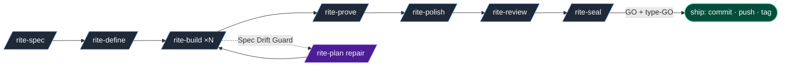

<p align="center">
  
</p>

**Per-feature workspace on disk.** Every feature gets its own `.devrites/work/<slug>/`
directory with `spec.md` → `plan.md` → `tasks.md` → `state.md` → `evidence.md` (plus
`decisions.md`, `assumptions.md`, `drift.md`, `questions.md`, `review.md`, `seal.md`,
`handoff.md`, and `references/`). When you `/clear`, the next agent picks up from those
files — no chat-context summary required. **Spec Drift Guard** catches the wrong turn
before it costs you a day. **AFK mode** runs unattended without silently accepting
destructive migrations, auth changes, or red tests. **`type-GO`** demands a literal
typed confirmation before any irreversible commit / push / tag.

```
.devrites/
  ACTIVE                    # which feature is active
  AFK                       # presence = AFK mode; YAML body sets max_slices / notify / allow_gates
  work/<slug>/
    spec.md  plan.md  tasks.md  state.md  evidence.md
    decisions.md  assumptions.md  drift.md  questions.md
    references/  browser-evidence.md  touched-files.md
    polish-report.md  review.md  seal.md  handoff.md
```

**Stop your AI from shipping half-baked code.** DevRites turns Claude Code into a
disciplined senior engineer — one that asks the right questions before writing a line,
ships features you can actually trust, and refuses to claim "done" without proof.

**Two run modes, same workflow:**

- **HITL** (default, human-in-the-loop) — you're at the keyboard. Slices marked
  `Mode: HITL` pause **before** code is written at a typed checkpoint (`advisory` /
  `validating` / `blocking` / `escalating`); resume on
  [`/rite-resolve <qid> "<answer>"`](pack/.claude/skills/rite-resolve/SKILL.md).
- **AFK** (away-from-keyboard) — drop `.devrites/AFK` in the project. AFK slices run
  unattended; discretionary pauses downgrade to advisory entries in `questions.md` so
  the loop keeps moving. **Destructive migrations, auth/authz changes, public-API
  breaks, and red tests/types/lint always pause regardless** — AFK never silently
  accepts irreversible risk. Optional `max_slices` caps the loop; optional `notify:`
  pings your phone on a pause.

Jump to the full contract → [Modes — HITL & AFK](#modes--hitl--afk).

Every phase is available **two ways**: the menu form `/rite <verb>` (one entry,
discoverable from `/rite`) and the direct shortcut `/rite-<verb>` (muscle
memory). Both hit the same skill — `/rite spec foo` ≡ `/rite-spec foo`.

| # | Phase | Menu form | Direct shortcut | Does |
|---|---|---|---|---|
| 1 | SPEC | `/rite spec` | [`/rite-spec`](pack/.claude/skills/rite-spec/SKILL.md) | investigate + write spec.md |
| 2 | PLAN | `/rite define` | [`/rite-define`](pack/.claude/skills/rite-define/SKILL.md) | spec → plan + slices (each tagged AFK \| HITL + gate) |
| 3 | BUILD ×N | `/rite build` | [`/rite-build`](pack/.claude/skills/rite-build/SKILL.md) | one slice, then stop (HITL slices pause pre-code) |
| 4 | PROVE | `/rite prove` | [`/rite-prove`](pack/.claude/skills/rite-prove/SKILL.md) | tests + browser proof |
| 5 | POLISH | `/rite polish` | [`/rite-polish`](pack/.claude/skills/rite-polish/SKILL.md) | code + UI polish |
| 6 | REVIEW | `/rite review` | [`/rite-review`](pack/.claude/skills/rite-review/SKILL.md) | multi-axis, parallel |
| 7 | SEAL | `/rite seal` | [`/rite-seal`](pack/.claude/skills/rite-seal/SKILL.md) | GO / NO-GO + type-GO |
| — | RESUME | `/rite resolve` | [`/rite-resolve`](pack/.claude/skills/rite-resolve/SKILL.md) | answer a HITL gate, clears `Awaiting human`, resumes |

If implementation reveals the plan is wrong, the **Spec Drift Guard** stops
the build, records the drift, asks you when product behavior changes, and
routes through [`/rite-plan repair`](pack/.claude/skills/rite-plan/SKILL.md)
before resuming.



Full diagram set (lifecycle, polish orchestrator, review fan-out, debug loop,
rules carrier, workspace state, namespace map) →
[`docs/flow.md`](docs/flow.md).

**Status:** [`v1.0.4`](https://github.com/ViktorsBaikers/DevRites/releases/tag/v1.0.4) — see [`CHANGELOG.md`](CHANGELOG.md) for release notes.

## Contents

- [Why distributed skills](#why-distributed-skills-not-one-engine)
- [Modes — HITL & AFK](#modes--hitl--afk)
- [Install](#install) — [bash (A, recommended)](#option-a-bash-installer-recommended-full-install) · [plugin (B, partial)](#option-b-claude-code-plugin-partial--skills--agents-only)
- [Recommended setup](#recommended-setup-optional-but-devrites-is-much-sharper-with-it) — codegraph · graphify · browser-harness
- [Skills](#skills) — 23 total · full catalogue in [`docs/skills.md`](docs/skills.md)
- [Typical workflow](#typical-workflow) · [Worked examples](docs/usage.md)
- [Engineering rules](#engineering-rules) · [Browser proof ladder](#browser-proof-ladder) · [Frontend & fullstack](#frontend--fullstack)
- [Safety & scope](#safety--scope) · [Security model](#security-model)
- [Layout](#layout) · [Community & quality](#community--quality) · [Release pipeline](docs/release.md) · [License](#license)

**Companion docs:**
[architecture](docs/architecture.md) ·
[skills catalogue](docs/skills.md) ·
[command map](docs/command-map.md) ·
[flow diagrams](docs/flow.md) ·
[usage examples](docs/usage.md) ·
[release pipeline](docs/release.md) ·
[engineering rules](pack/.claude/rules/README.md)

## Why distributed skills, not one `/engine`

A single command that does everything loads every phase's instructions at once, creates
constant context pressure, and hides the intent of each step. DevRites splits the
lifecycle into ~10 small public skills (`rite-*`) that each own one phase and load only
what that phase needs, plus internal specialists (`devrites-*`) that fire on triggers.

**Naming:** the `devrites-` prefix is a **namespace** for collision avoidance against
bundled Claude Code skill names (`prototype`, `handoff`, `triage`, `diagnose`, …) —
it does not signal "internal." Visibility is governed by each skill's
`user-invocable:` flag, not by the prefix. See
[`docs/flow.md` § Public vs internal namespace](docs/flow.md#8-public-vs-internal-namespace).

Full rationale: [`docs/architecture.md`](docs/architecture.md).

## Install

DevRites installs **into a project** (project-local only — it never writes to
`~/.claude`). Two install paths are supported:

| Path | Ships | When to use |
|---|---|---|
| **A. bash installer** *(recommended)* | skills, agents, **rules**, aliases | full DevRites — any Claude Code version |
| B. Claude Code plugin | skills, agents *(no rules)* | Claude Code 2.1+ if you want plugin-managed updates and don't need the engineering rules |

> **Heads-up:** the Claude Code plugin manifest only ships `skills/` and
> `agents/` — there is no plugin field for the DevRites engineering rules.
> If you install via the plugin you'll need a follow-up `--rules-only` bash
> run to drop the rules into `.claude/rules/` (see Option B below).

### Option A: bash installer (recommended, full install)

**One-liner over the network** — no `git clone` required:

```bash
# Install latest release into the current directory
curl -fsSL https://raw.githubusercontent.com/ViktorsBaikers/DevRites/main/install.sh | bash

# Install into a specific project
curl -fsSL https://raw.githubusercontent.com/ViktorsBaikers/DevRites/main/install.sh | bash -s -- --target /path/to/your/project

# Preview (no changes)
curl -fsSL https://raw.githubusercontent.com/ViktorsBaikers/DevRites/main/install.sh | bash -s -- --dry-run

# Pin to a specific release
curl -fsSL https://raw.githubusercontent.com/ViktorsBaikers/DevRites/main/install.sh | DEVRITES_REF=v0.1.0 bash
```

The script is self-bootstrapping: when piped through `bash` it auto-downloads the latest
release tarball (or the `main` source archive as fallback) into `/tmp` and re-execs from
there. Requires `curl` and `tar`. No global writes, ever — `~/.claude` is refused.

**From a local checkout** (same script, no network needed):

```bash
git clone https://github.com/ViktorsBaikers/DevRites devrites && cd devrites
./install.sh --target /path/to/your/project        # or run from inside the project
./install.sh --dry-run                              # preview, change nothing
```

Common flags:

| Flag | Effect |
|---|---|
| `--target DIR` | Install into DIR (default: current directory) |
| `--dry-run` | Show planned file operations and exit |
| `--force` | Overwrite existing non-DevRites files |
| `--no-rules` | Skip the engineering rules |
| `--no-agents` | Skip the review subagents |
| `--rules-only` | Install only the engineering rules — pair with Option B below |
| `--short-aliases=all` | Add `/define`, `/build`, `/prove`, `/seal` short aliases (off by default) |

Every installed file is recorded in `.claude/devrites.manifest` (with the installed
version and the original install flags in the header). `./uninstall.sh` removes
exactly those files (and prunes empty dirs) — your feature data in
`.devrites/work/` and `.devrites/ACTIVE` is preserved.

### Option B: Claude Code plugin (partial — skills + agents only)

```bash
claude plugin marketplace add ViktorsBaikers/DevRites
claude plugin install devrites@devrites-marketplace
```

The plugin runtime places **skills + agents** in their canonical Claude Code
locations and lets you manage updates with `claude plugin update devrites`.
Uninstall with `claude plugin uninstall devrites`.

**The plugin does not install the DevRites engineering rules.** The Claude
Code plugin manifest has no `rules` field — `core.md`, `state-machine.md`,
`afk-hitl.md`, `browser-proof.md`, and the rest of `.claude/rules/` won't be
present. Many skills (`/rite-build`, `/rite-prove`, `/rite-polish`, …) cite
those rules at runtime and degrade noticeably without them.

To add the rules after a plugin install, run the bash installer in
`--rules-only` mode:

```bash
# Drop only the engineering rules into the current project's .claude/rules/
curl -fsSL https://raw.githubusercontent.com/ViktorsBaikers/DevRites/main/install.sh | bash -s -- --rules-only

# Or target a specific project
curl -fsSL https://raw.githubusercontent.com/ViktorsBaikers/DevRites/main/install.sh | bash -s -- --target /path/to/your/project --rules-only
```

This writes nothing outside `.claude/rules/` and records the rule files in
`.claude/devrites.manifest`. Running `./uninstall.sh` later removes only
what's in the manifest (just the rules in this case) — the plugin's own
skills + agents are managed by `claude plugin uninstall devrites`.

### Upgrading an existing install

**One-liner over the network**:

```bash
# Upgrade the install in the current directory
curl -fsSL https://raw.githubusercontent.com/ViktorsBaikers/DevRites/main/update.sh | bash

# Upgrade an install elsewhere
curl -fsSL https://raw.githubusercontent.com/ViktorsBaikers/DevRites/main/update.sh | bash -s -- --target /path/to/proj

# Just check (exit 10 = update available, 0 = current)
curl -fsSL https://raw.githubusercontent.com/ViktorsBaikers/DevRites/main/update.sh | bash -s -- --check
```

From a local checkout:

```bash
./update.sh                          # upgrade install in current directory
./update.sh --target /path/to/proj   # upgrade install elsewhere
./update.sh --check                  # report installed vs latest, change nothing
./update.sh --to v0.2.0              # pin to a specific tag
./update.sh --pre                    # allow pre-release tags
./update.sh --force                  # reinstall even when already current
```

`update.sh` reads the installed version + original flags from
`.claude/devrites.manifest`, asks the GitHub API for the latest release tag,
downloads the release tarball, and re-runs the bundled `install.sh` with the
same flags + `--force`. `.devrites/` (active feature, work) is preserved
because the installer only touches manifest-tracked paths.

### Uninstalling

```bash
# Network one-liner
curl -fsSL https://raw.githubusercontent.com/ViktorsBaikers/DevRites/main/uninstall.sh | bash
curl -fsSL https://raw.githubusercontent.com/ViktorsBaikers/DevRites/main/uninstall.sh | bash -s -- --target /path

# Local checkout
./uninstall.sh                       # remove DevRites from the current project
./uninstall.sh --target /path/to/proj
./uninstall.sh --dry-run             # preview, change nothing
```

Removes only files listed in `.claude/devrites.manifest` and prunes empty dirs.
`.devrites/work/` (your feature data) is always preserved.

## Recommended setup (optional, but DevRites is much sharper with it)

DevRites runs with zero extra tooling, but three tools make it meaningfully better.
**Install and configure them in your project before you start** — DevRites detects each
one and **degrades gracefully** when it's absent.

| Tool | What it gives DevRites | Set up |
|---|---|---|
| **codegraph** | A code-intelligence index. `/rite-spec`, `/rite-define`, and `/rite-plan` use it to understand structure, **placement**, callers, and **impact** cheaply — deeper investigation and sharper specs, at a fraction of the tokens of reading files. | Build the index in your project (e.g. `codegraph init`) so its `codegraph_*` tools / a `.codegraph/` are present. |
| **graphify** | A codebase → knowledge-graph (`graphify-out/`) — same benefit for "where is X / what calls Y / what would Z break". | Generate it for your project (the `/graphify` skill). |
| **[browser-harness](https://github.com/browser-use/browser-harness)** | Drives your real browser so `/rite-prove` and `/rite-polish` capture **real UI evidence** — screenshots, console, network, responsive — the top rung of the proof ladder. | Install it, connect it to your Chrome, and verify with its doctor. |

Without them, DevRites reads files instead of a code graph and uses Claude Code's built-in
`/run`+`/verify` (or documented manual steps) instead of a browser. With them: deeper
investigation, cheaper context, and real browser proof. None are required.

## Skills

The pack ships **23 skills total** — 15 user-invocable `rite-*` workflow + utility skills, 8 model-invoked `devrites-*` specialists. **Prefix convention:** `rite-*` is the user-facing slash-command surface; `devrites-*` is internal (model-invoked, hidden from the menu). Each skill is a structured workflow with its own operating rules, anti-rationalization tables, and red flags. Engineering rules live at `.claude/rules/` and are autoloaded by Claude Code natively — no carrier skill.

**Two invocation forms.** Every user-invocable skill responds to **both** `/rite <verb>` (menu form — type `/rite` to discover) and `/rite-<verb>` (direct shortcut — muscle memory). The forms are equivalent: `/rite build slice-2` ≡ `/rite-build slice-2`. Use whichever reads more naturally.

**Custom pinned aliases** (optional). Add your own one-word shortcuts to any `rite-*` skill at runtime with `scripts/pin.sh` — useful for muscle-memory commands like `/b` → `/rite-build` or `/ship` → `/rite-seal`. The wrapper is a thin delegate (same shape the installer uses for `--short-aliases=all`); pinned aliases are manifest-tracked so `./uninstall.sh` cleans them up.

```bash
./scripts/pin.sh add b rite-build      # /b == /rite-build
./scripts/pin.sh add ship rite-seal    # /ship == /rite-seal
./scripts/pin.sh list                  # show currently-pinned aliases
./scripts/pin.sh remove b              # drop the alias
```

Pinned aliases live at `.claude/skills/<alias>/SKILL.md`. The script refuses `rite-*` names, unknown targets, and writes to `~/.claude`.

### Full skill + agent inventory

**Public `rite-*` skills (15)** — slash-command surface:

| Group | Skills |
|---|---|
| Lifecycle (7) | `rite-spec` · `rite-define` · `rite-build` · `rite-prove` · `rite-polish` · `rite-review` · `rite-seal` |
| Resume / replan | `rite-resolve` · `rite-plan` |
| Utility | `rite-status` · `rite-zoom-out` · `rite-prototype` · `rite-handoff` · `rite-pressure-test` |
| Menu | `rite` |

**Internal `devrites-*` specialists (8)** — model-invoked, hidden from menu:

`devrites-interview` · `devrites-source-driven` · `devrites-doubt` ·
`devrites-frontend-craft` · `devrites-browser-proof` · `devrites-debug-recovery` ·
`devrites-api-interface` · `devrites-audit` (axes: `security` · `perf` · `simplify`).

**Review agents (8)** — fresh-context reviewers under `.claude/agents/`:

`devrites-spec-reviewer` · `devrites-code-reviewer` · `devrites-test-analyst` ·
`devrites-frontend-reviewer` · `devrites-security-auditor` ·
`devrites-performance-reviewer` · `devrites-doubt-reviewer` ·
`devrites-simplifier-reviewer`.

Full catalogue with per-phase tables and interactions → [`docs/skills.md`](docs/skills.md). Trigger phrases + interactions → [`docs/command-map.md`](docs/command-map.md). Diagrams (polish orchestrator, review fan-out, seal fan-out, namespace map) → [`docs/flow.md`](docs/flow.md).

## Modes — HITL & AFK

DevRites runs the same lifecycle two ways. The mode is per-slice (declared in
`tasks.md` at planning time) and per-session (`.devrites/AFK` sentinel toggles the
session-level default). Skills consult both.

### HITL — human-in-the-loop (default)

Slices marked `Mode: HITL` pause **before any code is written**. `/rite-build`
renders the checkpoint, writes `Awaiting human` to `state.md`, appends the question
to `questions.md`, and stops. You answer with
[`/rite-resolve <qid> "<answer>"`](pack/.claude/skills/rite-resolve/SKILL.md) and the
workflow resumes. The pause is pre-action by design — no half-built slice, no
"approve after the fact" loop.

Each HITL slice declares a **gate type** that controls how much it disrupts the loop:

| Gate | Stakes | Behavior | SLA |
|---|---|---|---|
| `advisory` | low | log + proceed; surface for audit | none |
| `validating` | medium | async — build continues, merge blocks until reviewed | 4h |
| `blocking` | high | synchronous pause; loop stops | 15m |
| `escalating` | novel pattern | synchronous pause, route to specialist tag | 24h |

Full taxonomy + decision tree:
[`pack/.claude/skills/rite-define/reference/gates.md`](pack/.claude/skills/rite-define/reference/gates.md).

### AFK — away-from-keyboard

Drop `.devrites/AFK` in the project. AFK slices run unattended;
[`devrites-doubt`](pack/.claude/skills/devrites-doubt/SKILL.md) and other
discretionary pauses downgrade to advisory entries in `questions.md` so the loop
keeps moving. The sentinel is plain YAML (all keys optional):

```yaml
# .devrites/AFK — presence = AFK active.
max_slices: 10                       # /rite-build decrements per built slice; 0 → forced HITL stop
notify: "ntfy.sh/my-topic"           # shell command run on awaiting_human; qid / gate / slice in env
allow_gates: [advisory, validating]  # gate severities AFK may auto-handle
```

**AFK never silently accepts irreversible risk.** Regardless of `allow_gates`, the
workflow pauses on: destructive data migration · auth/authz boundary change · public
API break · external-service contract change · filesystem destruction outside the
workspace · red tests / types / lint at slice end. The same `blocking` + `escalating`
gates always pause in AFK too — `allow_gates` only widens what's automatic, not what's
irreversible.

```bash
# Run unattended for the next stretch:
echo 'max_slices: 10' > .devrites/AFK
echo 'notify: "ntfy.sh/my-topic"' >> .devrites/AFK

# Back to HITL:
rm .devrites/AFK
```

Recommended progression: start HITL, refine the prompt and plan over a few slices, then
drop the sentinel for the bulk stretch. Always cap iterations. Full contract:
[`pack/.claude/rules/afk-hitl.md`](pack/.claude/rules/afk-hitl.md).

## Typical workflow

```
# start a feature
/rite-spec add-csv-export     # investigate deeply → spec.md (asks you; gathers design refs)
/rite-define                  # spec → plan.md + tasks.md + state.md

# build loop — one slice at a time
/rite-build                   # slice 1, stops with evidence
/rite-build                   # slice 2 ... repeat for each slice
/rite-prove                   # ONCE all slices built: full tests + browser proof

# finish
/rite-polish                  # code polish always + UI normalize/polish if UI in scope
/rite-review                  # feature-scoped multi-axis (parallel Spec + Standards)
/rite-seal                    # GO / NO-GO + type-GO before commit/push/tag

# check in any time
/rite                         # menu + next command (no state read)
/rite-status                  # full status: phase, evidence, drift, handoff readiness
```

If implementation reveals the plan is wrong, the **Spec Drift Guard** stops
the build, records the drift in `drift.md`, asks you when product behavior
changes, and routes through `/rite-plan repair` before resuming.

Worked examples (spec-then-plan, mid-build drift, UI feature with
browser-harness, backend-only, polish modes, zoom-out, mid-flight handoff):
**[docs/usage.md](docs/usage.md)**.

## Engineering rules

DevRites ships its own stack-agnostic engineering rules and installs them to
`.claude/rules/` — 16 rule files plus a README index. They're **common** by design
(no language assumptions); a project's own conventions always win where they exist.
Skip them with `--no-rules`. Loading model: `core.md` is autoloaded by Claude Code
from `.claude/rules/core.md` at session start; the other 15 rule files load on
demand via `Read` from the skill body that needs them.

| Always-on | On-demand |
|---|---|
| `core.md` | `coding-style.md` · `error-handling.md` · `testing.md` · `code-review.md` · `security.md` · `performance.md` · `patterns.md` · `git-workflow.md` · `hooks.md` · `documentation.md` · `development-workflow.md` · `agents.md` · `context-hygiene.md` · `afk-hitl.md` · `anti-patterns.md` |

Full index with phase mapping: [`pack/.claude/rules/README.md`](pack/.claude/rules/README.md);
diagram: [`docs/flow.md` § Engineering-rules autoload](docs/flow.md#6-engineering-rules-carrier).

## Browser proof ladder

For UI work DevRites prefers real runtime evidence, top-down: **browser-harness** (if
installed) → **Chrome DevTools MCP** → Claude Code **`/run`+`/verify`** → **project-native
E2E** (Playwright / Cypress / Capybara) → **manual fallback**. It detects tooling but
never installs it, stops at auth walls, and treats a screenshot **path** as unproven
until it's opened and described.

## Frontend & fullstack

UI work runs through `devrites-frontend-craft`: detect the surface register (brand vs
product), **shape before code** (all states — default / loading / empty / error / success
/ disabled), build from the existing design system, avoid generic-AI tells, and meet the
**2026 quality bar** — Core Web Vitals (LCP ≤ 2.5 s / INP ≤ 200 ms / CLS ≤ 0.1) and WCAG
2.2 AA. **Fullstack features** go **contract-first**: define the API/data contract, build
one **vertical slice** through the layers (DB → service → API → UI), apply the
engineering rules to the backend and the craft to the UI, map every contract error to a
real UI state, and **prove both layers** (contract tests + browser proof).

## Safety & scope

- **Project-local only.** Never writes to `~/.claude`. Manifest-managed install/uninstall.
- **Feature scope only.** Review/simplify/polish/security stay within the active feature
  and touched files — no project-wide refactors, no drive-by cleanup.
- **One slice at a time.** `/rite-build` stops after a single verified slice.
- **Evidence over confidence.** Claims need recorded commands, output, or screenshots.
- **Ask before danger.** Material assumptions, dependency additions, a second design
  system, destructive operations, and product-behavior changes are surfaced, not assumed.

## Layout

```
devrites/
  .claude-plugin/      # plugin.json + marketplace.json (claude plugin install path)
  .github/             # workflows/ (ci, release, dependabot-auto-merge) + dependabot.yml
  .husky/              # commit-msg hook (Conventional Commits via commitlint)
  .releaserc.json      # semantic-release config (CHANGELOG, version sync, tarball, GitHub Release)
  install.sh  uninstall.sh  update.sh
  scripts/             # install-lib · validate · validate-frontmatter · run-evals · eval-runner.py
                       # devrites-detect · check-no-global-writes · sync-version · build-release-tarball
  pack/.claude/        # skills/  23 skills — 15 public + 8 model-invoked    ─┐
                       # agents/  8 fresh-context reviewers                    ├─ the pack
                       # rules/   16 rule files + README index                 ┘
  evals/               # trigger evals (20 queries per public skill)
  docs/                # architecture · skills · command-map · usage · flow · release
    internal/          # research, development notes (gitignored)
  tests/               # install/uninstall smoke · install fixture · pack validation
  dist/                # release tarballs built by semantic-release (gitignored)
  CHANGELOG.md  SECURITY.md  CODE_OF_CONDUCT.md  CODEOWNERS  NOTICE.md  LICENSE
  package.json  commitlint.config.js   # husky/commitlint/semantic-release toolchain
```

Cross-links: [architecture](docs/architecture.md) ·
[skills catalogue](docs/skills.md) ·
[command-map](docs/command-map.md) ·
[flow diagrams](docs/flow.md) ·
[usage](docs/usage.md) ·
[release pipeline](docs/release.md) ·
[engineering rules](pack/.claude/rules/README.md).

## Security model

DevRites is auditable Markdown + a small set of shell scripts. The complete security
policy, including private vulnerability reporting and recommended managed-deployment
settings, lives in [`SECURITY.md`](SECURITY.md). Highlights: **project-local only**
(installer refuses any target under `~/.claude`); **no network access** in installer or
skills (no remote code execution); **`!` shell injection removed** from `/rite` and
`/rite-status` (state loaded via a `Bash`-invoked script that reads only DevRites' own
state under `.devrites/`); **auto-trigger** is a deliberate design choice mitigated by
body discipline + readiness gates + the interactive `type-GO` confirmation in `/rite-seal`
before irreversible git actions; **no `defaultMode: bypassPermissions`** is shipped or
written by the installer (cf. CVE-2026-33068).

## Community & quality

- **Changelog:** [`CHANGELOG.md`](CHANGELOG.md) — Keep-a-Changelog + SemVer, regenerated by semantic-release on every release.
- **Code of conduct:** [`CODE_OF_CONDUCT.md`](CODE_OF_CONDUCT.md) (Contributor Covenant 2.1).
- **Code owners:** [`CODEOWNERS`](CODEOWNERS) — review required on `pack/`, `scripts/`, `install.sh`, `uninstall.sh`, `.claude-plugin/`.
- **Notices:** [`NOTICE.md`](NOTICE.md).
- **CI:** GitHub Actions runs `scripts/validate.sh`, install/uninstall smoke, fixture install, commitlint, and the eval suite on every PR.
- **Commits:** Conventional Commits enforced via husky + commitlint.
- **Release pipeline:** semantic-release on every push to `main` — full details in [`docs/release.md`](docs/release.md).

## License

**Free to use, with approval gating redistribution.** Personal use and *listing this
repository in plugin marketplaces* are permitted without approval. Any other use —
distributing it, distributing modified versions, mirroring as a fork, or commercial /
organizational use — requires **approval on request** (ask via
[the repo](https://github.com/ViktorsBaikers/DevRites)). Source-available. See
[`LICENSE`](LICENSE). DevRites is independent software for use with Claude Code.
