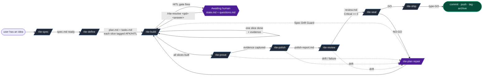
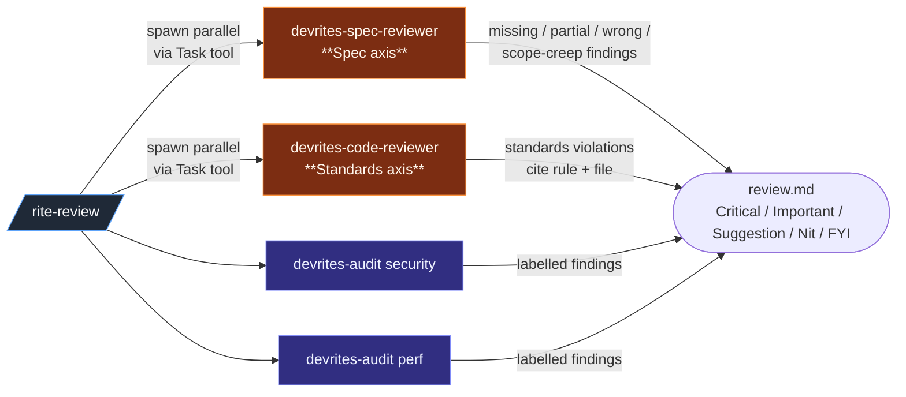
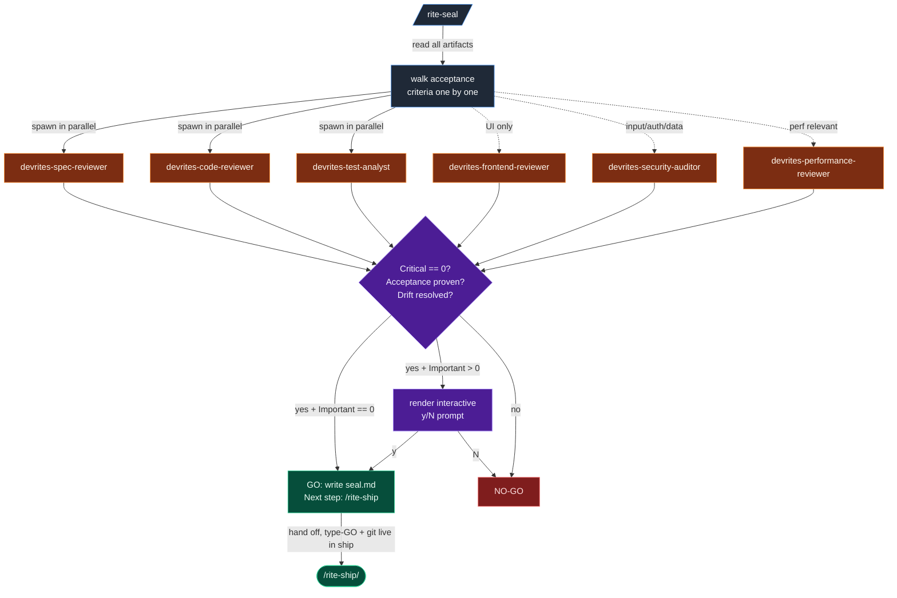
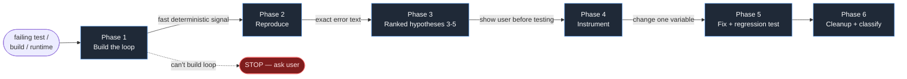
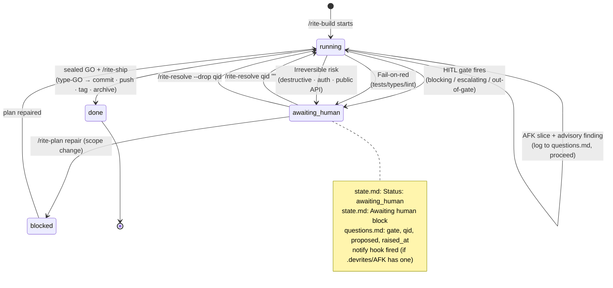

# DevRites — flow diagrams

Visual reference for how the skills, agents, and rules fit together. GitHub
renders Mermaid natively — open this file on the repo to see the graphs.

For the full per-skill table, see [`command-map.md`](command-map.md). For the
"why" behind each piece, see [`architecture.md`](architecture.md).

## 1. Feature lifecycle

The happy path. Every arrow assumes the readiness gate of the previous phase
passed; failures route through `/rite-plan repair` or `devrites-debug-recovery`.
HITL slices pause before code is written; `/rite-resolve` is the resume verb.

## 2. `/rite-polish` orchestrator

`/rite-polish` is a thin dispatcher that always runs code polish and runs UI
polish only when the diff touches UI files.

Mode tokens passed to `/rite-polish` (`bolder`, `quieter`, `distill`,
`harden`, `normalize-only`) flow through to Phase 4 (`reference/ui.md`) as
emphasis dials. `normalize-only` stops after Phase 3.

## 3. `/rite-review` parallel axes

Review runs Spec coverage and Standards compliance in parallel sub-agents so
neither masks the other.

## 4. `/rite-seal` fan-out

The seal fans out **all** relevant reviewers in parallel and reconciles their
findings, then **decides** GO / NO-GO and stops. It no longer runs git — on GO
it hands off to `/rite-ship`, which renders the type-GO prompt and runs the
irreversible commit · push · tag · archive. The advisory `/20` score has been
removed — the gate is severity + acceptance + drift.

## 5. `devrites-debug-recovery` six-phase loop

Failure recovery — the loop construction in Phase 1 is the load-bearing piece.

Each phase's detail lives in a separate reference file under
`pack/.claude/skills/devrites-debug-recovery/reference/` so the SKILL.md body
stays small.

## 6. Engineering-rules carrier

Each `rite-*` skill Reads `.claude/rules/core.md` (the always-on subset) as
its first step (step 0); the other rule files load on demand. Per-phase
skills pull additional rule files via plain `Read` as their workflow
demands. No carrier skill, no session-start autoload.

```mermaid
flowchart TD
    R[rite-* skill<br/>step 0] -->|always-on| Core[.claude/rules/core.md]
    R -->|on demand index| Idx[(.claude/rules/README.md<br/>15 specialist rule files)]
    Idx --> CS[coding-style.md]
    Idx --> EH[error-handling.md]
    Idx --> T[testing.md]
    Idx --> CR[code-review.md]
    Idx --> S[security.md]
    Idx --> P[performance.md]
    Idx --> Pat[patterns.md]
    Idx --> Gw[git-workflow.md]
    Idx --> Hk[hooks.md]
    Idx --> Doc[documentation.md]
    Idx --> DWf[development-workflow.md]
    Idx --> Ag[agents.md]
    Idx --> CH[context-hygiene.md]
    Idx --> Afk[afk-hitl.md]
    Idx --> AP[anti-patterns.md]

    Build[/rite-build/] -.->|pulls| CS
    Build -.->|pulls| EH
    Build -.->|pulls| T
    Polish[/rite-polish/] -.->|pulls| CS
    Polish -.->|pulls| Pat
    Review[/rite-review/] -.->|pulls| CR
    Review -.->|pulls| S
    Review -.->|pulls| P
    Seal[/rite-seal/] -.->|pulls| Ag
    Seal -.->|pulls| CR
    Ship[/rite-ship/] -.->|pulls| Gw

    classDef carrier fill:#312e81,stroke:#818cf8,color:#eef2ff
    classDef rule fill:#1f2937,stroke:#9ca3af,color:#f9fafb
    classDef phase fill:#064e3b,stroke:#34d399,color:#ecfdf5
    class R carrier
    class Core,CS,EH,T,CR,S,P,Pat,Gw,Hk,Doc,DWf,Ag,CH,Afk,AP rule
    class Build,Polish,Review,Seal,Ship phase
```

## 7. Workspace state model

`.devrites/work/<feature-slug>/` is the durable memory each phase reads
before doing anything. **Every** rite-* skill reads the workspace first; if
no `ACTIVE` is set, it tells the user to run `/rite-spec`. The optional
`.devrites/AFK` sentinel sits beside `ACTIVE` and toggles the session-level
run mode for all skills.

```mermaid
erDiagram
    ACTIVE ||--o| WORKSPACE : points-to
    AFK_SENTINEL }|..|| RUN_MODE : "presence is authoritative — skills re-read at decision time"
    WORKSPACE ||--|| state : has
    WORKSPACE ||--|| brief : has
    WORKSPACE ||--|| spec : has
    WORKSPACE ||--|| plan : "has (from /rite-define)"
    WORKSPACE ||--|| tasks : "has — slices tagged Mode + Gate"
    WORKSPACE ||--o{ references : "has (design refs)"
    WORKSPACE ||--|| questions : "has — qid, gate, status (open/answered/dropped)"
    WORKSPACE ||--|| decisions : has
    WORKSPACE ||--|| assumptions : has
    WORKSPACE ||--|| drift : has
    WORKSPACE ||--|| touched-files : "has (from /rite-build)"
    WORKSPACE ||--|| evidence : "has (from /rite-prove)"
    WORKSPACE ||--o| browser-evidence : "has (UI features)"
    WORKSPACE ||--o| polish-report : "has (from /rite-polish)"
    WORKSPACE ||--o| review : "has (from /rite-review)"
    WORKSPACE ||--o| seal : "has (from /rite-seal)"
    WORKSPACE ||--o| ship : "has (from /rite-ship; archived on close)"

    ACTIVE {
        string slug "names the current workspace"
    }
    AFK_SENTINEL {
        bool present "presence = AFK active"
        int max_slices "read-only initial budget — copied to state.md once"
        string notify "optional shell command on pause"
        list allow_gates "gate severities AFK may auto-handle"
    }
    WORKSPACE {
        string slug PK ".devrites/work/<slug>/"
    }
    state {
        string phase "spec | plan | build | prove | polish | review | seal | ship | done"
        string status "running | awaiting_human | blocked | done"
        string active_slice "N — name"
        int afk_slices_remaining "from .devrites/AFK max_slices on first AFK build"
        block awaiting_human "qid, gate, question, proposed, raised_at (only when paused)"
    }
    questions {
        string qid PK "q-YYYY-MM-DD-NNN"
        string status "open | answered | dropped"
        string gate "advisory | validating | blocking | escalating"
    }
```

The exact list of files per workspace and what each holds is in
[`usage.md`](usage.md#the-workspace). The full pause/resume contract is in
[`pack/.claude/rules/afk-hitl.md`](../pack/.claude/rules/afk-hitl.md).

## 8. Public vs internal namespace

The `devrites-` prefix is collision-avoidance against bundled Claude Code
skills (`prototype`, `handoff`, `triage`, `diagnose`). Visibility is the
`user-invocable:` flag, not the prefix.

## 9. AFK & HITL state machine

The pause/resume primitive for HITL gates and the AFK loop discipline. The
gate firing on `/rite-build` is the only writer of `Awaiting human`;
`/rite-resolve` is the only canonical clearer.

`AFK` mode (`.devrites/AFK` present) widens which transitions stay in
`running` via `allow_gates` — but `blocking`, `escalating`, fail-on-red, and
the irreversible-risk list always transition to `awaiting_human` regardless.
