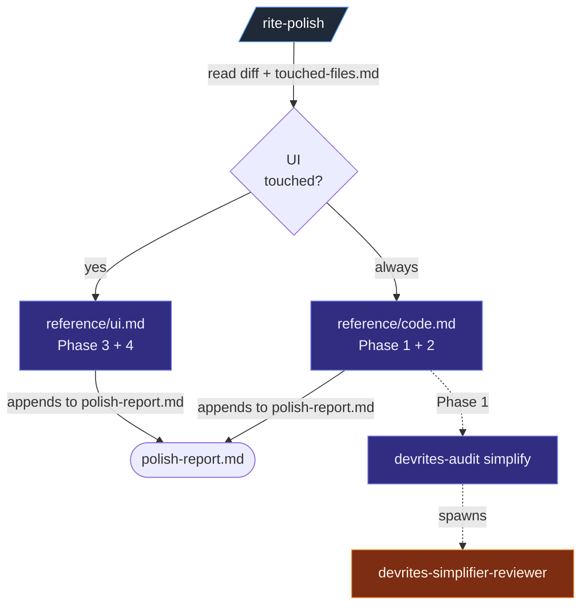
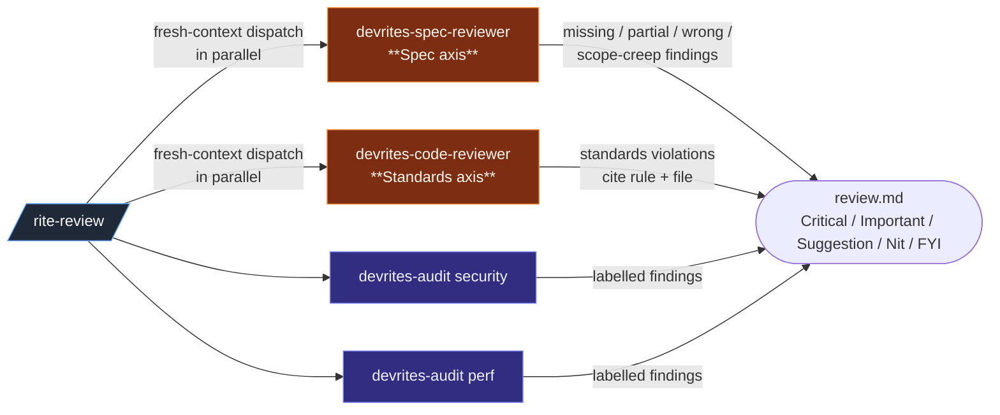
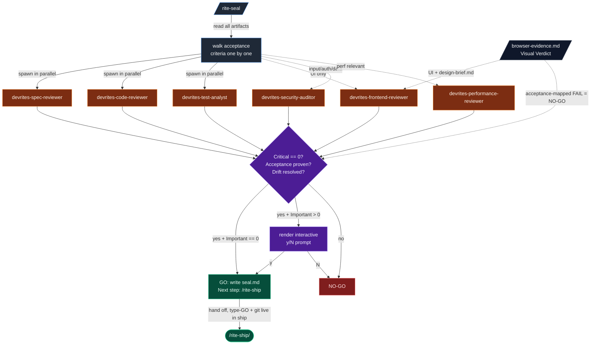

# DevRites flow diagrams

These diagrams show how the skills, agents, and rules interact. GitHub renders
the Mermaid blocks when you open this file in the repository.

For the full per-skill table, see [`command-map.md`](command-map.md). For the
"why" behind each piece, see [`architecture.md`](architecture.md).

## 1. Feature lifecycle

This diagram shows the normal path. Each arrow assumes that the previous
phase's readiness gate passed. Failures route through `/rite-clarify`,
`/rite-plan repair`, or `devrites-debug-recovery`. `/rite-clarify` always runs
but may ask zero questions; `/rite-temper` is the optional strategic branch;
`/rite-vet` runs on every defined plan, with depth scaled to risk. Build asks
the human only for genuine
product/scope/policy decisions, irreversible risk, or human-only access/actions;
`/rite-resolve` is the resume verb.

```mermaid
flowchart LR
    Start([user has an idea]) --> Spec[/rite-spec/]
    Spec -.->|UI detected| Shape[devrites-ux-shape<br/>plan UX/UI → design-brief.md]
    Shape -.->|brief confirmed| Spec
    Spec -->|spec.md ready| Clarify[/rite-clarify/]
    Clarify -->|fresh digest-bound CLEAR<br/>big / risky| Temper[/rite-temper/] -.->|strategy.md| Define
    Clarify -->|fresh digest-bound CLEAR<br/>low stakes| Define[/rite-define/]
    Define -->|plan.md + tasks.md<br/>approved| Plan[(plan checkpoint)]
    Plan -->|normal resume| Vet[/rite-vet/]
    Vet -->|fresh digest-bound READY<br/>+ test-plan.md| Build[/rite-build/]
    Build -.->|exact .wright-allowlist<br/>retained baseline| Wright[devrites-slice-wright]
    Wright -.->|typed result| Build
    Build -->|one slice done<br/>+ evidence| Build
    Build -.->|"Forge: yes slice"| Forge[forge: K candidates<br/>→ devrites-forge-judge → 1 winner]
    Forge -.->|winner lands<br/>forge-report.md| Build
    Build -->|product / risk / access gate| Await{{Awaiting human<br/>state.md + questions.md}}
    Await -->|"/rite-resolve &lt;qid&gt; &lt;answer&gt;"| Build
    Build -->|all slices built| Prove[/rite-prove/]
    Build -.->|resumed / adopted / stalled<br/>code vs intent| Converge[/rite-converge/]
    Converge -.->|appends remaining slices<br/>invalidates old READY| Vet
    Converge -.->|already converged| Prove
    Prove -->|evidence captured| Polish[/rite-polish/]
    Polish -->|polish-report.md| Review[/rite-review/]
    Review -->|review.md<br/>Critical == 0| Seal[/rite-seal/]
    Seal -->|GO| Ship2[/rite-ship/]
    Ship2 -->|type-GO| Shipped([commit · push · tag · archive])
    Seal -->|NO-GO| Repair[/rite-plan repair/]
    Repair --> Plan

    Build -.->|Spec Drift Guard| Repair
    Prove -.->|drift / failure| Repair
    Polish -.->|drift| Repair
    Review -.->|drift| Repair

    classDef phase fill:#1f2937,stroke:#60a5fa,stroke-width:1px,color:#f9fafb
    classDef done fill:#064e3b,stroke:#34d399,color:#ecfdf5
    classDef repair fill:#4c1d95,stroke:#a78bfa,color:#f5f3ff
    classDef gate fill:#4c1d95,stroke:#a78bfa,color:#f5f3ff
    classDef internal fill:#0f172a,stroke:#9ca3af,color:#f9fafb
    class Spec,Clarify,Temper,Define,Plan,Vet,Build,Prove,Polish,Review,Seal,Ship2 phase
    class Shipped done
    class Repair repair
    class Await gate
    class Shape,Forge,Wright internal
```

## 2. `/rite-polish` orchestrator

`/rite-polish` is a thin dispatcher that always runs code polish and runs UI
polish only when the diff touches UI files.

Mode tokens passed to `/rite-polish` (`bolder`, `quieter`, `distill`,
`harden`, `normalize-only`) flow through to Phase 4 (`reference/ui.md`) as
emphasis dials. `normalize-only` stops after Phase 3.

## 3. `/rite-review` parallel axes

Review assigns Spec coverage and Standards compliance to separate
fresh-context agents and runs them in parallel. This prevents one axis from
masking the other.

## 4. `/rite-seal` fan-out

The seal runs all relevant reviewers in parallel, reconciles their findings,
decides GO or NO-GO, and stops without running git. On GO, `/rite-ship` renders
the type-GO prompt and runs the irreversible commit · push · tag · archive
sequence. The gate uses severity, acceptance, and drift rather than an advisory
score.

## 5. `devrites-debug-recovery` seven-step loop

Failure recovery starts by routing the faulty layer. `recovery route <class>`
returns its owner, action, and whether a human decision is actually needed.
The root-cause fingerprint and three-failure budget persist across agents and
sessions in `recovery-attempts.jsonl`; typed entries keep independent defects
on independent budgets.

```mermaid
flowchart LR
    F([failing test /<br/>build / runtime]) --> Route{Route faulty layer}
    Route -->|technical class<br/>humanPause: false| L1[Step 1<br/>Build the loop]
    Route -->|intent / missing decision| Clarify([Clarify with the human])
    L1 -->|fast deterministic signal| R[Step 2<br/>Reproduce]
    R -->|exact error text| H[Step 3<br/>Ranked hypotheses 3-5]
    H --> T[Step 4<br/>Trace when ambiguous]
    T -->|discriminating probe| I[Step 5<br/>Instrument]
    I -->|change one variable| Fix[Step 6<br/>Fix + regression test]
    Fix --> C[Step 7<br/>Cleanup + classify]
    C -->|green: recovery clear --class| Done([verified])
    C -->|same root cause red:<br/>recovery record --class| Budget{3 failures<br/>used?}
    Budget -->|no: recovery check<br/>+ exact failure| L1
    Budget -->|yes| Block([technical blocker<br/>reproduction + dead ends])

    classDef phase fill:#1f2937,stroke:#60a5fa,color:#f9fafb
    classDef stop fill:#7f1d1d,stroke:#f87171,color:#fee2e2
    class L1,R,H,T,I,Fix,C phase
    class Block,Clarify stop
```

A separate file under
`pack/.claude/skills/devrites-debug-recovery/reference/` documents each step.
This keeps the `SKILL.md` body small.

## 6. Engineering-rules carrier

Workspace-operating lifecycle skills read
`.claude/skills/devrites-lib/reference/standards/core.md` in step 0; compact utilities
keep their narrower contract local. The other rule files load on demand.
Per-phase skills use plain `Read` calls to load any additional rule files their
workflows need. There is no carrier skill or session-start autoload.

```mermaid
flowchart TD
    R[rite-* skill<br/>step 0] -->|always-on| Core[.claude/skills/devrites-lib/reference/standards/core.md]
    R -->|on demand index| Idx[(.claude/skills/devrites-lib/reference/standards/README.md<br/>on-demand rule files)]
    Idx --> CS[coding-style.md]
    Idx --> EH[error-handling.md]
    Idx --> T[testing.md]
    Idx --> CR[code-review.md]
    Idx --> S[security.md]
    Idx --> P[performance.md]
    Idx --> Pat[patterns.md]
    Idx --> Gw[git-workflow.md]
    Idx --> Hk[hooks.md]
    Idx --> Doc[documentation.md]
    Idx --> DWf[development-workflow.md]
    Idx --> Ag[agents.md]
    Idx --> CH[context-hygiene.md]
    Idx --> Afk[afk-hitl.md]
    Idx --> AP[anti-patterns.md]

    Build[/rite-build/] -.->|pulls| CS
    Build -.->|pulls| EH
    Build -.->|pulls| T
    Polish[/rite-polish/] -.->|pulls| CS
    Polish -.->|pulls| Pat
    Review[/rite-review/] -.->|pulls| CR
    Review -.->|pulls| S
    Review -.->|pulls| P
    Seal[/rite-seal/] -.->|pulls| Ag
    Seal -.->|pulls| CR
    Ship[/rite-ship/] -.->|pulls| Gw

    classDef carrier fill:#312e81,stroke:#818cf8,color:#eef2ff
    classDef rule fill:#1f2937,stroke:#9ca3af,color:#f9fafb
    classDef phase fill:#064e3b,stroke:#34d399,color:#ecfdf5
    class R carrier
    class Core,CS,EH,T,CR,S,P,Pat,Gw,Hk,Doc,DWf,Ag,CH,Afk,AP rule
    class Build,Polish,Review,Seal,Ship phase
```

## 7. Workspace state model

Each phase reads its durable state from `.devrites/work/<feature-slug>/` before
acting. Every `rite-*` skill checks the workspace first; if `ACTIVE` is unset,
it tells the user to run `/rite-spec`. The optional
`.devrites/AFK` sentinel sits beside `ACTIVE` and toggles the session-level
run mode for all skills.

```mermaid
erDiagram
    ACTIVE ||--o| WORKSPACE : points-to
    AFK_SENTINEL }|..|| RUN_MODE : "presence is authoritative: skills re-read at decision time"
    WORKSPACE ||--|| state : has
    WORKSPACE ||--|| brief : has
    WORKSPACE ||--|| spec : has
    WORKSPACE ||--o| decision-coverage : "has (semantic + digest-bound CLEAR before planning)"
    WORKSPACE ||--o| strategy : "has (optional: from /rite-temper)"
    WORKSPACE ||--|| plan : "has (from /rite-define)"
    WORKSPACE ||--|| tasks : "has: slices tagged Mode + Gate"
    WORKSPACE ||--o| eng-review : "has (semantic + digest-bound READY from /rite-vet)"
    WORKSPACE ||--o| test-plan : "has (from /rite-vet; build + prove read it)"
    WORKSPACE ||--o{ references : "has (design refs)"
    WORKSPACE ||--o| design-brief : "has (UI features: from /rite-spec via devrites-ux-shape; the build target)"
    WORKSPACE ||--|| questions : "has: qid, gate, status (open/answered/dropped)"
    WORKSPACE ||--|| decisions : has
    WORKSPACE ||--|| assumptions : has
    WORKSPACE ||--|| drift : has
    WORKSPACE ||--|| touched-files : "has (from /rite-build)"
    WORKSPACE ||--|| evidence : "has (from /rite-prove)"
    WORKSPACE ||--o| browser-evidence : "has (UI features)"
    WORKSPACE ||--o| polish-report : "has (from /rite-polish)"
    WORKSPACE ||--o| review : "has (from /rite-review)"
    WORKSPACE ||--o| seal : "has (from /rite-seal)"
    WORKSPACE ||--o| ship : "has (from /rite-ship; archived on close)"
    WORKSPACE ||--o| recovery_attempts : "durable three-failure budget per root cause"
    WORKSPACE ||--o| wright_allowlist : "root-owned exact source/test paths"

    ACTIVE {
        string slug "names the current workspace"
    }
    AFK_SENTINEL {
        bool present "presence = AFK active"
        int max_slices "read-only initial budget: copied to state.md once"
        string notify "optional shell command on pause"
        list allow_gates "gate severities AFK may auto-handle"
    }
    WORKSPACE {
        string slug PK ".devrites/work/<slug>/"
        int schemaVersion "2; older additive layouts remain readable"
    }
    state {
        string phase "frame | spec | clarify | temper | define | plan | vet | build | converge | prove | polish | review | seal | ship | done"
        string status "running | awaiting_human | blocked | done"
        string active_slice "N: name"
        int afk_slices_remaining "from .devrites/AFK max_slices on first AFK build"
        string return_phase "durable later-phase clarify return"
        string return_next_action "restored only after fresh CLEAR"
        block awaiting_human "qid, gate, question, proposed, raised_at (only when paused)"
    }
    questions {
        string qid PK "q-YYYY-MM-DD-NNN"
        string status "open | answered | dropped"
        string gate "advisory | validating | blocking | escalating"
    }
```

The exact list of files per workspace and what each holds is in
[`usage.md`](usage.md#the-workspace). The full pause/resume contract is in
[`pack/.claude/skills/devrites-lib/reference/standards/afk-hitl.md`](../pack/.claude/skills/devrites-lib/reference/standards/afk-hitl.md).

## 8. Public vs internal namespace

The `devrites-` prefix is collision-avoidance against bundled Claude Code
skills (`prototype`, `handoff`, `triage`, `diagnose`). Visibility is the
`user-invocable:` flag, not the prefix; automatic model loading is controlled
separately by `disable-model-invocation`.

## 9. AFK & HITL state machine

This state machine shows pauses for HITL gates and the AFK loop. Only the root
`/rite-build` orchestrator writes `Awaiting human`, and only `/rite-resolve`
clears it.

```mermaid
stateDiagram-v2
    [*] --> running: /rite-build starts
    running --> running: AFK slice + advisory finding<br/>(log to questions.md, proceed)
    running --> recovery: objective red<br/>(tests · types · lint · runtime · coverage)
    recovery --> running: green<br/>recovery clear --class
    recovery --> blocked: 3 failed attempts<br/>reproduction + dead ends; no question
    running --> awaiting_human: product / scope / policy choice
    running --> awaiting_human: irreversible risk or<br/>human-only access / action
    awaiting_human --> running: /rite-resolve qid "<answer>"
    awaiting_human --> running: /rite-resolve --drop qid
    awaiting_human --> blocked: /rite-plan repair (scope change)
    blocked --> running: plan repaired
    running --> done: sealed GO + /rite-ship<br/>(type-GO → commit · push · tag · archive)
    done --> [*]

    note right of awaiting_human
        state.md: Status: awaiting_human
        state.md: Awaiting human block
        questions.md: gate, qid, proposed, raised_at
        notify hook fired (if .devrites/AFK has one)
    end note
```

`AFK` mode (`.devrites/AFK` present) widens which advisory/validating
transitions stay in `running`. It never turns objective technical failures into
human questions: bounded recovery either returns green or records a technical
blocker. Genuine human-owned decisions and actions still transition to
`awaiting_human`.
