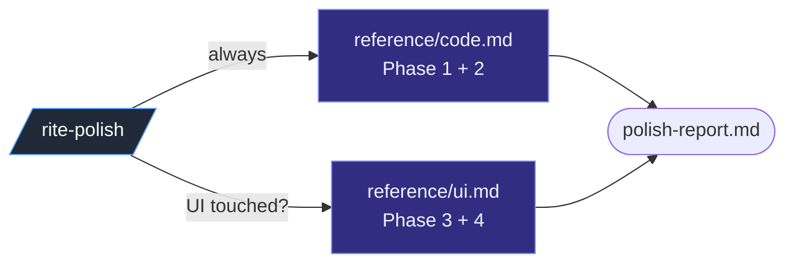

# All 44 skills

The pack contains 44 skills: the `rite` menu, 31 user-invocable `rite-*`
workflow and utility skills, 11 model-invoked `devrites-*` specialists, and the
internal `devrites-lib` library. `devrites-lib` is not a command. It holds shared
references and the few explicit script exceptions.

Install DevRites through npm with `npx devrites ...`. DevRites is not available
through a Claude or Codex plugin store. The installer generates host-specific
artifacts, copies Codex skill mirrors to `.agents/skills`, mirrors the rules
under `.agents/skills/devrites-lib/reference/standards`, installs
`.codex/agents`, and merges the Codex hooks and guidance.

The installed `devrites-engine` owns orientation, read-only gates, and state
changes. Claude Code, Codex, CI, and human operators therefore get the same
verdicts. Lifecycle skills load `core.md` in step 0 and read other phase rules
only when needed; small utilities keep their narrower contract local. The npm
`devrites` shim bootstraps or proxies the engine directly (see
[`cli.md`](cli.md)).

Every canonical skill declares `required-agent-roles`. A comma-separated list
means those fresh agents are mandatory for a Codex invocation; `none` means no
agent is unconditionally required. Host generation preserves the field and
validation rejects missing or unresolved role contracts.

## Naming convention

`rite-*` is the namespace for lifecycle and utility commands. Its utilities are
`rite-quick`, `rite-frame`, `rite-adopt`, `rite-learn`, `rite-customize`,
`rite-explain`, `rite-pov`, `rite-dogfood`, `rite-pr-feedback`, `rite-doctor`,
`rite-upgrade`, `rite-prototype`, `rite-handoff`, `rite-zoom-out`, and
`rite-pressure-test`.
Some specialized utilities set `disable-model-invocation: true` and run only
when explicitly invoked, which keeps the always-loaded skill surface small.
`devrites-*` is the specialist and library namespace used to avoid collisions.
The `user-invocable:` and `disable-model-invocation:` fields, not the prefix,
set visibility and invocation policy. [`command-map.md`](command-map.md)
catalogs the effective values.

---

## Failure-mode section convention

Every skill documents the mistakes most likely in that phase. This follows
Anthropic's guidance to record observed model failures and extend the list over
time. New skills use the heading `## Gotchas`. Existing skills use the
equivalent headings below, which also satisfy the convention:

- **Lifecycle skills** → a `> **Mid-flight discipline.**` blockquote pointing at
  `reference/anti-patterns.md` (rite-spec, -temper, -define, -vet, -build, -prove,
  -polish, -review, -seal, -ship, -plan, -resolve, -autocomplete).
- **Specialists / utilities** → `## Hard rules` (browser-proof, debug-recovery),
  `## NEVER` (ux-shape), `## Rules` (doubt, source-driven), `## Boundaries`
  (pressure-test), `## Don't ask` (interview), `## When NOT to use` (zoom-out),
  `## What NOT to include` (handoff), `## Scope reminders` (audit), `## Anti-AI-slop`
  (frontend-craft), the numbered rule list (prototype), and `## Gotchas`
  (api-interface, rite, status).

New or materially edited skills SHOULD use `## Gotchas` for two or three
phase-specific traps drawn from
`pack/.claude/skills/devrites-lib/reference/standards/anti-patterns.md`. Do not
repeat the positive workflow steps there. Existing headings do not need a
mechanical rename because their content already meets the convention.

## Command invocation

Every public `rite-<verb>` skill has four equivalent forms: Claude `/rite <verb>` or `/rite-<verb>`, and Codex `$rite <verb>` or `$rite-<verb>`. See the canonical [`command-map.md`](command-map.md) for the per-command inventory, triggers, and interactions.

## Completion reply contract

Workspace-operating `rite-*` skills render `devrites-engine progress` first, then a compact
completion reply from
[`reply-contract.md`](../pack/.claude/skills/devrites-lib/reference/reply-contract.md).
The progress command owns the deterministic header, slice meter, and flow
ribbon. The chat reply summarizes only `Done`, `Changed`, `Evidence`, `Open`,
one `Next` command, `Record`, and `↻ Hygiene`. Detailed reports stay in durable
workspace artifacts such as `spec.md`, `plan.md`, `evidence.md`, `review.md`,
`seal.md`, and `ship.md`.

Typed stop states are standardized too: `Awaiting human`, `Stopped`, `NO-GO`, `GO`,
and `Shipped`. Utility commands that do not operate on an active workspace declare a
reply-contract exception but still keep the same compact labels and one-next-action
rule. `scripts/check-reply-contract.sh` enforces the reference/exception marker and
blocks obvious multi-command `Next:` wording.

---

## Phase-by-phase catalogue

### Menu and status: find your place

| Skill | What It Does | Use When |
|---|---|---|
| [`rite`](../pack/.claude/skills/rite/SKILL.md) | Compact menu + active-feature status + suggested next command. Does not run a workflow. | Explicit-only: type `/rite` or `$rite`. |
| [`rite-status`](../pack/.claude/skills/rite-status/SKILL.md) | Read-only report: phase, run mode (AFK/HITL), status, active slice, next action, evidence, open questions by gate, drift, risks. | Explicit-only: type `/rite-status` / `/rite status`. |
| [`rite-resolve`](../pack/.claude/skills/rite-resolve/SKILL.md) | Answer / drop / batch-resolve open `questions.md` entries; clears `state.md` `Awaiting human` and resumes the workflow. | Explicit-only: type `/rite-resolve <qid> "<answer>"`. |
| [`rite-doctor`](../pack/.claude/skills/rite-doctor/SKILL.md) | Diagnose DevRites install, workspace, and optional index health. `--reindex` runs the internal synchronous refresh. | "rite doctor", "is DevRites healthy", "reindex". |
| [`rite-upgrade`](../pack/.claude/skills/rite-upgrade/SKILL.md) | Reconcile an active unfinished workspace with the current semantic planning contract while preserving completed source, slices, decisions, and evidence. | Explicit-only: build readiness returns code `8`, or you need to continue a workspace planned under older DevRites rules. |
| [`rite-customize`](../pack/.claude/skills/rite-customize/SKILL.md) | Guided authoring for project-local reviewer overrides and extensions; validates before stopping. | Explicit-only: `/rite-customize` / `/rite customize`. |

### Express and ad hoc: small or unguarded work

| Skill | What It Does | Use When |
|---|---|---|
| [`rite-quick`](../pack/.claude/skills/rite-quick/SKILL.md) | Express lane for a **small, reversible, unambiguous** change: one-line contract → TDD build → scoped prove → review-lite → ship, collapsing the full lifecycle into one pass. Significance gate first: auth / migration / public-API / destructive / multi-slice / ambiguous **escalates to `/rite-spec`**. | "quick fix", "small change", "tiny tweak", "just do X" on a low-risk change. |
| [`rite-frame`](../pack/.claude/skills/rite-frame/SKILL.md) | Pre-flight + self-audit lens for ad-hoc work the lifecycle gates never see: FRAME converts an imperative ask into a falsifiable success criterion + verify command before code; AUDIT checks a raw diff against the four LLM coding failure modes (silent assumption / overcomplication / out-of-scope edit / unverifiable goal). | Top of `/rite-quick`, before a plain "just do X" edit, or to self-review a raw diff. |
| [`rite-adopt`](../pack/.claude/skills/rite-adopt/SKILL.md) | Bring an EXISTING codebase under DevRites: reverse-derive a `spec.md` of current behavior + placement + architecture, and seed the conventions ledger from the idioms the code already follows, then hand off to the lifecycle. | "adopt this project", "onboard this codebase", "we already have code", "reverse-engineer a spec from the existing app". |

### Spec: understand the request before writing code

| Skill | What It Does | Use When |
|---|---|---|
| [`rite-spec`](../pack/.claude/skills/rite-spec/SKILL.md) | Deep investigation → writes `spec.md`. Decides **placement**, names what it resolves, closes gaps with you, gathers design refs. | You start a feature, have a vague idea, attach screenshots/Figma/video, or say "spec this". |
| [`devrites-ux-shape`](../pack/.claude/skills/devrites-ux-shape/SKILL.md) | **Plans UX/UI before code**: writes the feature-level `design-brief.md` (design direction, key states, interaction model, Figma/image visual-direction probe) that the build targets. Woven into spec/build, not a separate phase. | `/rite-spec` detects UI, or you say "shape the UX" / "plan the UI before coding" / "design direction". |
| [`devrites-interview`](../pack/.claude/skills/devrites-interview/SKILL.md) | One-question-at-a-time interview until ~95% confidence. | The ask is underspecified, or user says "interview me" / "grill me". |
| [`rite-pressure-test`](../pack/.claude/skills/rite-pressure-test/SKILL.md) | Structured divergent → convergent thinking; rough concept → buildable proposal. | The idea itself needs exploration before specifying; users say "ideate", "stress-test my plan", "I have a vague idea". |

### Clarify: close decision coverage before technical planning *(required, adaptive)*

| Skill | What It Does | Use When |
|---|---|---|
| [`rite-clarify`](../pack/.claude/skills/rite-clarify/SKILL.md) | Reuses `devrites-interview` to enumerate topology, search facts, audit assumptions, close human-owned decisions, and write a semantic, input-digest-bound `CLEAR` verdict. Later-phase retrofits persist and restore their return cursor when the contract is unchanged. | After every full spec; also retrofits an active workspace missing decision coverage. Complete/small specs take the zero-question path. |

### Temper: strategic review before planning *(optional; mandatory in `/rite-autocomplete`)*

| Skill | What It Does | Use When |
|---|---|---|
| [`rite-temper`](../pack/.claude/skills/rite-temper/SKILL.md) | Strategic review of a readied `spec.md`: pick a scope mode (expand / selective / hold-rigor / reduce-to-MVP), run a pre-mortem, score 9 dimensions on a floor-gate, then write `strategy.md` and fold decisions into `spec.md` / `decisions.md` / `assumptions.md` via the Spec Drift Guard. Adversarial fresh-context loop via [`devrites-strategy-reviewer`](../pack/.claude/agents/devrites-strategy-reviewer.md). Ambition on outcomes, minimalism on the surface. | A big / risky feature (auth · data model · public API · migration · multi-slice · ambiguous scope), or you say "think bigger" / "scope check" / "pre-mortem". Skips low-stakes specs in one line. |

### Plan: decompose into vertical slices

| Skill | What It Does | Use When |
|---|---|---|
| [`rite-define`](../pack/.claude/skills/rite-define/SKILL.md) | Approved, clarified spec → architecture alternatives/contracts + `plan.md` + vertical task slices + `state.md`. | `spec.md` is approved and `decision-coverage.md` is `CLEAR`. |
| [`rite-plan`](../pack/.claude/skills/rite-plan/SKILL.md) | Decompose / reslice / repair an active plan after drift; `revise` updates planning artifacts only. | Spec Drift Guard fires, or you need to repair/revise an existing plan. |
| [`rite-converge`](../pack/.claude/skills/rite-converge/SKILL.md) | Assess live code vs clarified intent; append remaining work as traceable slices, invalidate the prior READY verdict, and return the changed plan through `/rite-vet`. | Resuming a half-built or stalled feature, or after `/rite-adopt` when code drifted from the derived spec. |

### Vet: lock in the engineering plan before building

| Skill | What It Does | Use When |
|---|---|---|
| [`rite-vet`](../pack/.claude/skills/rite-vet/SKILL.md) | Engineering review of `plan.md` + `tasks.md`: scope challenge (reuse / minimum-diff / complexity smell), then architecture / plan code-quality / test-coverage design / performance through senior-engineer lenses, every finding confidence-banded with a quote-the-source verification gate. Maps failure modes + parallel lanes, hardens the plan, and writes `test-plan.md` plus a semantic, input-digest-bound `READY` verdict; acceptance-changing deltas fold back via the Spec Drift Guard. Adversarial fresh-context loop via [`devrites-plan-reviewer`](../pack/.claude/agents/devrites-plan-reviewer.md) on the full pass; optional `--cross-model` second opinion. | **Every defined plan, before build.** Depth scales with the stakes: a light pass on a simple, reversible plan; the full pass on a big or risky one (migration · auth · public API · data model · multi-slice · >8 files · new dependency). Never skipped; always in `/rite-autocomplete`. |

### Build: one verified slice at a time

| Skill | What It Does | Use When |
|---|---|---|
| [`rite-build`](../pack/.claude/skills/rite-build/SKILL.md) | Orchestrates **exactly one** vertical slice through the sole wright. The root writes an exact `.wright-allowlist`, retains the original baseline through snapshot → reconcile check → test/package integrity → close, and refreshes only the dispatch boundary on retries. Objective failures use bounded agent-owned recovery; only genuine product/risk/access decisions become human gates. A `Forge: yes` slice still isolates candidates and lands one judged winner. | A plan exists and fresh digest-bound `CLEAR` and `READY` gates plus `test-plan.md` pass. |
| [`devrites-source-driven`](../pack/.claude/skills/devrites-source-driven/SKILL.md) | Consult official docs / source before relying on framework behavior; record the source. | API, config, or framework behavior is assumed rather than known. |
| [`devrites-api-interface`](../pack/.claude/skills/devrites-api-interface/SKILL.md) | Design stable API / interface contracts: REST/GraphQL, module boundaries, type contracts, FE/BE split. | A slice crosses a boundary or defines a public interface. |
| [`devrites-debug-recovery`](../pack/.claude/skills/devrites-debug-recovery/SKILL.md) | Reproduce → ranked hypotheses → instrument → fix in scope → regression-test. A fingerprinted ledger preserves the three-failure budget across agents and sessions. | Tests, builds, or runtime checks fail. |
| [`devrites-refresh-indexes`](../pack/.claude/skills/devrites-refresh-indexes/SKILL.md) | Internal synchronous refresh for optional code-intelligence indexes. The Stop hook runs automatically; `/rite-doctor --reindex` owns the user route. | Structural lookup disagrees with live code, or doctor requests a refresh. |

### Prove: collect evidence, including browser evidence

| Skill | What It Does | Use When |
|---|---|---|
| [`rite-prove`](../pack/.claude/skills/rite-prove/SKILL.md) | Tests + build + runtime + browser evidence for the current scope. | All slices built; ready for full verification. |
| [`devrites-browser-proof`](../pack/.claude/skills/devrites-browser-proof/SKILL.md) | Browser proof ladder: Playwright MCP → Chrome DevTools MCP → `/run`+`/verify` → project E2E → manual. Auto-emits the structured **Visual Verdict** (per-criterion PASS/FAIL vs `design-brief.md`) for UI slices: consumed by `devrites-frontend-reviewer` and gated at `/rite-seal`. | Scope touches UI. |

### Polish: normalize, then check the details

| Skill | What It Does | Use When |
|---|---|---|
| [`rite-polish`](../pack/.claude/skills/rite-polish/SKILL.md) | Orchestrator. Always runs code polish (`reference/code.md`); detects UI scope and runs UI normalize + polish (`reference/ui.md`) when needed. Accepts mode tokens (`bolder`, `quieter`, `distill`, `harden`, `normalize-only`). | All slices proven; ready to finish. |
| [`devrites-frontend-craft`](../pack/.claude/skills/devrites-frontend-craft/SKILL.md) | Senior frontend craft: register, shape-before-code, all states, design system, anti-AI-slop, Core Web Vitals + WCAG 2.2. | A slice touches UI. |
| [`devrites-prose-craft`](../pack/.claude/skills/devrites-prose-craft/SKILL.md) | Human-voice writing for artifacts + replies: strips the LLM tells (filler openers, false contrasts, fake profundity, em-dash tics, hedging) while keeping precise lists, exact terms, and spec structure. The catch pass in `/rite-polish` Phase 1. | A phase writes prose (spec / plan / decisions / review / seal / commit / PR bodies) or a user-facing reply. |

### Review: adversarial and scoped to the feature

| Skill | What It Does | Use When |
|---|---|---|
| [`rite-review`](../pack/.claude/skills/rite-review/SKILL.md) | Multi-axis feature-scoped review. Parallel fresh-context **Spec axis** (`devrites-spec-reviewer`) + **Standards axis** (`devrites-code-reviewer`) agents; severity-labeled findings. | Polish done; ready for a final pass. |
| [`devrites-doubt`](../pack/.claude/skills/devrites-doubt/SKILL.md) | In-flight adversarial review of risky decisions: branching logic, boundaries, data/auth/API changes, migrations. | About to stand a "this is safe / scales / matches spec" claim. |
| [`devrites-audit`](../pack/.claude/skills/devrites-audit/SKILL.md) | Read-only audit dispatch: picks the right fresh-context reviewer on the requested axis (`security` / `perf` / `simplify`). Single-axis only; multi-axis parallel fan-out lives inline in `/rite-seal` (see the [shared dispatch contract](../pack/.claude/skills/devrites-lib/reference/parallel-dispatch.md)). | Polish Phase 1 (`simplify`); review involves user input / auth / data / external integrations / secrets / permissions (`security`); performance is relevant or regression risk visible (`perf`). |

### Seal: GO / NO-GO decision

| Skill | What It Does | Use When |
|---|---|---|
| [`rite-seal`](../pack/.claude/skills/rite-seal/SKILL.md) | Pure decision gate. Walks acceptance vs evidence, fans out reviewers, writes the GO / NO-GO verdict to `seal.md`. Decides only: no git; on GO it sets `state.md` `Next step: /rite-ship`. | Review is clean; you ask "GO / NO-GO", "is it safe to merge", "decide if we can ship". |

### Ship: execute and close the task

| Skill | What It Does | Use When |
|---|---|---|
| [`rite-ship`](../pack/.claude/skills/rite-ship/SKILL.md) | Final phase. Requires a GO in `seal.md` → renders type-`GO`, runs the irreversible git ladder (commit → push → tag/PR per project convention), writes `ship.md`, then closes the task: sets phase `done`, archives `.devrites/work/<slug>/` → `.devrites/archive/<slug>/` (all `.md` preserved), clears `.devrites/ACTIVE`. | Seal returned GO; you say "ship it", "ship this", "push it out", "close the task". |

### Utility: standalone helpers

| Skill | What It Does | Use When |
|---|---|---|
| [`rite-autocomplete`](../pack/.claude/skills/rite-autocomplete/SKILL.md) | Runs the whole lifecycle unattended (spec → clarify → … → seal → ship), choosing the recommended option at each soft gate and recording the rationale in `decisions.md`. A vague prompt triggers one up-front spec/clarify window; after decision coverage is CLEAR it runs without per-phase iteration, pausing only for genuine product/scope/policy decisions, irreversible risk, human-only access/actions, NO-GO, or budget exhaustion. Objective red checks use bounded technical recovery. Default stops at the final type-`GO`; `--ship` (alias `--yolo`) auto-confirms it. | "Autocomplete", "do the whole thing", "run the full cycle", "one-shot this feature". |
| [`rite-zoom-out`](../pack/.claude/skills/rite-zoom-out/SKILL.md) | Map the modules, callers, callees, and decisions in an unfamiliar area using the project's domain glossary. | Explicit-only: `/rite-zoom-out` / `/rite zoom-out`. |
| [`rite-prototype`](../pack/.claude/skills/rite-prototype/SKILL.md) | Throwaway code answering ONE design question: logic harness OR 2 to 4 UI variations on one route. | Explicit-only: `/rite-prototype` / `/rite prototype`. |
| [`rite-handoff`](../pack/.claude/skills/rite-handoff/SKILL.md) | Compact chat session → handoff doc. References existing `.devrites/work/<slug>/` artifacts by path. | Explicit-only: `/rite-handoff` / `/rite handoff`. |
| [`rite-learn`](../pack/.claude/skills/rite-learn/SKILL.md) | Cross-feature learning loop: mine shipped features for recurring mistakes + dismissed-finding classes (`devrites-engine learnings mine`), propose project-local lessons into `.devrites/learnings.md` (loaded by the review skills before a fan-out). | Explicit-only: `/rite-learn` / `/rite learn`. |
| [`rite-explain`](../pack/.claude/skills/rite-explain/SKILL.md) | The human half of the learning loop: turns a concept, diff, idea, or recent work into a dense explainer; diff inputs can instead produce a concern-ordered human review walkthrough. | Explicit-only: `/rite-explain` / `/rite explain`. |
| [`rite-pov`](../pack/.claude/skills/rite-pov/SKILL.md) | Project-grounded verdict on a named external option: adopt / trial / hold / reject / not-our-problem after project + external floors clear. | "should we adopt X", "switch to Y", CVE/deprecation relevance, bounded external comparisons. |
| [`rite-dogfood`](../pack/.claude/skills/rite-dogfood/SKILL.md) | Diff-scoped browser QA: map changed user journeys, run scenario matrix, fix small obvious breakages, write `dogfood.md`. | Explicit-only after prove/polish/review when browser UX confidence matters. |
| [`rite-pr-feedback`](../pack/.claude/skills/rite-pr-feedback/SKILL.md) | Resolve PR review feedback: fetch unresolved threads, judge centrally, fix valid items, reply, resolve. | Explicit-only: `/rite-pr-feedback` / `/rite pr-feedback`. |

### Foundation: engineering rules

| Skill | What It Does | Use When |
|---|---|---|
| (engineering rules) | Live at `.claude/skills/devrites-lib/reference/standards/` post-install: each `rite-*` skill Reads `.claude/skills/devrites-lib/reference/standards/core.md` as its first step (step 0); the remaining rule files load on demand per skill body. `README.md` is the index. No carrier skill, no session-start autoload. | n/a: step-0 core / on-demand by path. |

---

## Fresh-context agents

DevRites ships 18 roles at depth one: 17 read-only leaves and one source/test
writer. Four read-only roles handle bounded work while the root keeps
authority:

| Agent | Purpose |
|---|---|
| [`devrites-evidence-scout`](../pack/.claude/agents/devrites-evidence-scout.md) | Build a bounded evidence dossier for spec, clarify, converge, or cited external facts. |
| [`devrites-plan-drafter`](../pack/.claude/agents/devrites-plan-drafter.md) | Draft a planning candidate for define or plan repair; the root decides and writes artifacts. |
| [`devrites-proof-runner`](../pack/.claude/agents/devrites-proof-runner.md) | Run non-destructive proof commands against a read-only tree and return a proof report. |
| [`devrites-upgrade-planner`](../pack/.claude/agents/devrites-upgrade-planner.md) | Read an old workspace from scratch, classify semantic contract gaps, and return a bounded upgrade plan without changing files. |
| [`devrites-strategy-reviewer`](../pack/.claude/agents/devrites-strategy-reviewer.md) | **Pre-plan** spec-vs-rubric strategic review (ambition / scope / premise / pre-mortem / YAGNI / testability / irreversibility / cross-cutting / convention). Used by `/rite-temper`, not the seal fan-out. |
| [`devrites-plan-reviewer`](../pack/.claude/agents/devrites-plan-reviewer.md) | **Pre-build** plan-vs-rubric engineering review (architecture / scope-reuse / plan code-quality / test-coverage design / performance / reversibility / failure-mode coverage), confidence-banded with a quote-the-source verification gate. Used by `/rite-vet`, not the seal fan-out. |
| [`devrites-forge-judge`](../pack/.claude/agents/devrites-forge-judge.md) | **Build-time** comparative judge of two or three candidate builds of one slice (acceptance / test strength / principle fit / simplicity / reuse / anti-slop). Used by `/rite-build` on a `Forge: yes` slice; picks the single winner to land and names grafts. |
| [`devrites-spec-reviewer`](../pack/.claude/agents/devrites-spec-reviewer.md) | Does the diff implement the spec? Missing / partial / wrong criteria; scope creep. |
| [`devrites-code-reviewer`](../pack/.claude/agents/devrites-code-reviewer.md) | Correctness / readability / architecture / maintainability. |
| [`devrites-test-analyst`](../pack/.claude/agents/devrites-test-analyst.md) | Do the tests prove the acceptance criteria? |
| [`devrites-frontend-reviewer`](../pack/.claude/agents/devrites-frontend-reviewer.md) | UX, a11y, responsive, design-system, anti-AI-slop. |
| [`devrites-security-auditor`](../pack/.claude/agents/devrites-security-auditor.md) | OWASP Top 10, trust boundary, secrets, deps. |
| [`devrites-performance-reviewer`](../pack/.claude/agents/devrites-performance-reviewer.md) | N+1s, hot paths, payload size. |
| [`devrites-devex-reviewer`](../pack/.claude/agents/devrites-devex-reviewer.md) | Developer-experience scorecard + the predict-vs-measure boomerang (TTHW, getting-started, error-message quality, ergonomics, docs): predicts at `/rite-vet`, measures + reconciles at `/rite-seal`, when a developer-facing surface (API / CLI / SDK / webhook / config / errors / getting-started) is in scope. |
| [`devrites-doubt-reviewer`](../pack/.claude/agents/devrites-doubt-reviewer.md) | Adversarial check of a single claim/decision. |
| [`devrites-simplifier-reviewer`](../pack/.claude/agents/devrites-simplifier-reviewer.md) | Independent simplification judgment (called by `devrites-audit simplify`). |

**Cross-feature analyst** (read-only, scope is the archive not a diff):

| Agent | Purpose |
|---|---|
| [`devrites-retrospector`](../pack/.claude/agents/devrites-retrospector.md) | Mine the shipped `.devrites/archive/<slug>/` workspaces for recurring patterns + trends (repeated review findings, recurring drift, dead-ends, GO/NO-GO + rework signal) and **draft** graduation candidates for `/rite-learn`. Proposes, never imposes. Dispatched at `/rite-ship` close, cadence-gated. |

Seal fan-out diagram: [`flow.md` § /rite-seal fan-out](flow.md#4-rite-seal-fan-out).

---

## Executor agent: fresh-context writer

The system has one write-capable agent. `/rite-build` dispatches it in a clean
context with only the slice contract; all other agents are read-only.

| Agent | Purpose |
|---|---|
| [`devrites-slice-wright`](../pack/.claude/agents/devrites-slice-wright.md) | Turn ONE exact allowlisted slice into the smallest complete, idiomatic, proven implementation. Writes code + tests only; returns a typed artifact for the root to reconcile, gate, and record. Writes no `.devrites/` bookkeeping; single-threaded per tree. |

Dispatch contract + return shape + fallback: [`rite-build/reference/wright-dispatch.md`](../pack/.claude/skills/rite-build/reference/wright-dispatch.md).
The shared topology, named → guarded generic → HITL stop, and fail-closed identity
rules live in [`standards/agents.md`](../pack/.claude/skills/devrites-lib/reference/standards/agents.md).

---

## `/rite-polish` orchestrator

`/rite-polish` always runs code polish. It detects UI scope from the diff and
runs UI normalization and polish only when needed. The two parts live in
`reference/code.md` and `reference/ui.md` as progressive-disclosure references,
so the orchestrator body stays small and loads each reference only when its
trigger fires.

Argument modes (`bolder`, `quieter`, `distill`, `harden`, `normalize-only`) pass through to Phase 4 (`reference/ui.md`).

## `/rite-review` parallel axes & `/rite-seal` fan-out

`/rite-review` runs the Spec axis (`devrites-spec-reviewer`) and Standards axis
(`devrites-code-reviewer`) in parallel so neither masks the other. `/rite-seal`
fans out the full reviewer set and reconciles its findings before the GO / NO-GO
gate. Severity labels (Critical / Important / Suggestion / Nit / FYI) drive the
decision. There is no advisory score; the gate requires `Critical == 0`, proven
acceptance, and resolved drift. See the [`flow.md`](flow.md#3-rite-review-parallel-axes)
diagram.
