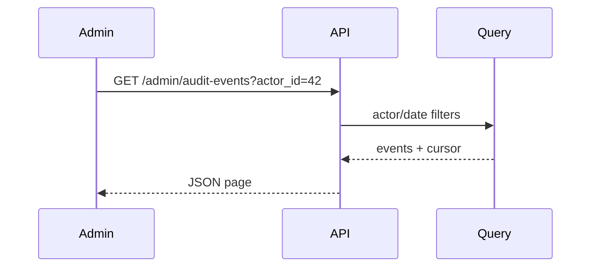

# Architecture

## Owning module / layer
API controller plus existing audit-event query object.

## Integration points
Admin routes call the query object and serialize the page result.

## Data / API / events
Read-only audit-events table access; no emitted events.

## Dependencies
Existing auth middleware and pagination helper.

## Risks
Filtering bugs could leak unrelated actor events.

## Affected boundaries
Admin API boundary and audit-event persistence boundary.

