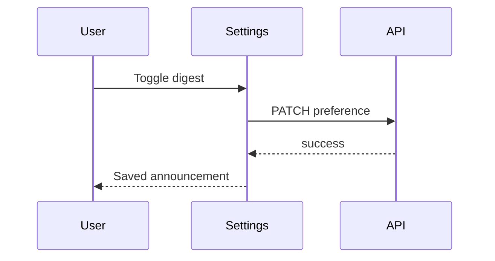

# Flows

## Toggle save sequence
Why this matters: AC-002 depends on save state, success announcement, and rollback on failure.

```mermaid
sequenceDiagram
  participant User
  participant Settings
  participant API
  User->>Settings: Toggle digest
  Settings->>API: PATCH preference
  API-->>Settings: success
  Settings-->>User: Saved announcement
```
